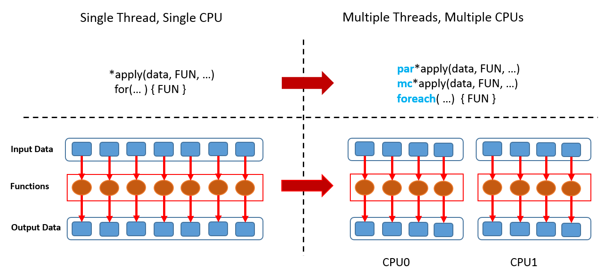
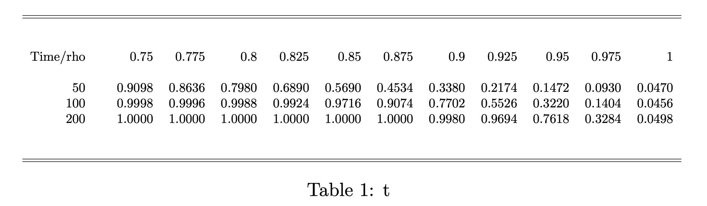

```{r setup, include=FALSE}
options(htmltools.dir.version = F)
knitr::opts_chunk$set(warning = F, message = F)
```

```{r xaringan-themer, include=FALSE}
# solarized_dark(
#   code_font_family = "Fira Code",
#   code_font_url    = "https://cdn.rawgit.com/tonsky/FiraCode/1.204/distr/fira_code.css"
# )
# library(xaringanthemer)
# 
# mono_accent(
#     base_color           = "#09017F",
#     header_font_google   = google_font("Roboto", "700"),
#     text_font_google     = google_font("Roboto Condensed"),
#     code_highlight_color = "#D2B6E8",
#     code_font_family     = "Fira Code",
#     code_font_url        = "https://cdn.rawgit.com/tonsky/FiraCode/1.204/distr/fira_code.css"
#     )
```

```{r, include=FALSE}
# packages needed
library(microbenchmark)
library(parallel)
library(tictoc)
library(dplyr)
library(tidyr)
```

class: top, left

### Performance &mdash; Overview

- Measuring Performance: Profiling and Microbenchmarking

- (Why) is R slow?

- Improving Performance

- Speeding Things Up Using <coce>Rcpp</code>

---
class: inverse, middle, left

background-image: url(img/road.jpg)
background-size: cover

### Measuring Performance

#### *Programmers waste enormous amounts of time thinking about, or worrying about, the speed of noncritical parts of their programs, and these attempts at efficiency actually have a strong negative impact when debugging and maintenance are considered.*

#### — Donald Knuth (famous american computer scientist) .

---
## Prerequisites

Before trying to make code run faster it is necessary to understand what is making it slow. `r emo::ji('snail')`


**Profiling** means measuring run time of our code line-by-line using realistic inputs in order to identify *bottlenecks*.

After identifying bottlenecks we experiment with equvalent alternatives of code and find the fastest using a **microbenchmark**.

We will use the packages `profvis` and `bench` for profiling and benchmarking. Please make sure they are installed by checking whether the following code chunk executes without issues.

```{r, echo=T, eval=F}
library(profvis)
library(bench)
```

---
class: inverse, middle, left

### Profiling

#### *It’s tempting to think you just know where the bottlenecks in your code are. I mean, after all, you write it! But trust me, I can’t tell you how many times I’ve been surprised at where exactly my code is spending all its time. The reality is that profiling is better than guessing.*

#### — Roger D. Peng

---
### Profiling - `utils::Rprof()`

`Rprof()` is a build-in *sampling profiler*. It keeps track of the *function call stack* at regularly sampled intervals.

- The function call stack is a record of the function currently executing, the function that called the function, and so on (from right to left)

- The default time interval between sampling is 0.02 seconds. If the profiled code executes faster you need to pass an appropriate sampling time to the arguement `interval`.

- The output of `Rprof()` is a complete listing of the function call stack at every sampling iteration (which, on its own, is often not very informative) which is printed to a binary file in the current working directory

- Note: results are *stochastic* &mdash; we never run a function twice under the same conditions (memory usage, CPU load etc.) 

---
### `utils::Rprof()`

**Example: profiling a call of `replicate()`**

```{r, eval = F, cache=TRUE}
tmp <- tempfile()

Rprof(tmp, interval = 0.1)       # start the profiler
replicate(5, mean(rnorm(1e6)))
Rprof(NULL)                      # stop profiling

writeLines(readLines(tmp))
```
```{r, echo=FALSE}
cat('
sample.interval=100000
"rnorm" "mean" "FUN" "lapply" "sapply" "replicate" 
"rnorm" "mean" "FUN" "lapply" "sapply" "replicate" 
"rnorm" "mean" "FUN" "lapply" "sapply" "replicate" 
')
```

So `rnorm()` is six levels deep in the call stack and it seems that R spends most of time evaluating `rnorm(1e6)` and the code takes ~ 0.3 seconds to run.

---
### `utils::Rprof()`

A more useful output is produced by `utils::summaryRprof()`. 

By appending `$by.total` we get the time spend in each function by the total run time. 

**Example: Profiling a call of `replicate()`**

```{r, eval=F}
summaryRprof(tmp)$by.total
```

```{r, echo = F}
cat('
             total.time total.pct self.time self.pct
"rnorm"            0.3       100       0.3      100
"FUN"              0.3       100       0.0        0
"lapply"           0.3       100       0.0        0
"mean"             0.3       100       0.0        0
"replicate"        0.3       100       0.0        0
"sapply"           0.3       100       0.0        0
')
```

---
### `utils::Rprof()`

By appending `$by.self` the results are adjusted for the time to run functions above the current function in the call stack.

**Example: profiling a call of `replicate()`**
```{r, eval=F}
summaryRprof(tmp)$by.self
```
```{r, echo = F}
cat('
       self.time self.pct total.time total.pct
"rnorm"       0.3      100        0.3       100
')
```

As expected, the random number generation takes approx. 100% of the total computation time.

---
### Visualising profiles: `profvis::profvis()`
**Example: profiling nested functions**

```{r}
# define some nested example functions
f <- function() {
  pause(0.1)
  g()
  h()
}

g <- function() {
  pause(0.1)
  h()
}

h <- function() {
  pause(0.1)
}
```

(We use `profvis::pause()` because the time spend in `base::sys.sleep()` is not measured as computing time.)

---
### Visualising profiles: `profvis::profvis()`
**Example: profiling nested functions**

Visualisation using `profvis()` works best when the code is sourced from an .R-script

```{r, eval=FALSE}
# source f(), g(), h() form R script
source("codes/profiling-example.R")

# visualise profiling results
profvis(f())
```

After profiling, `profvis()` opens an interactive HTML window will *RStudio* which lets you explore the results.

The interface provided by `profvis()` connects the profiling data back to the source code. This makes it easier to build up a 'mental' model of what you need to change.

---
background-image: url(img/profiling.png)
background-position: 50% 85%
background-size: 600px

### Visualising profiles: `profvis::profvis()`

---
### Visualising profiles: `profvis::profvis()`

The top pane 

- displays bar plots of running times and memory allocations with the latter being no issue here (why?)

- provides a good overall feel for bottlenecks but is quite imprecise about the *cause*

  `h()` is not significanly slower than `g()`: `h()` is reported to take 150 ms (twice as long as `g()`) because it is called two times.


The bottom pane shows a *flame graph* of the full call stack. The full sequence confirms that

 - `h()` is called from two different places (once by `g()` and once by `f()`)

 - the execution time of `h()` is roughly the same in each call.
 
Mousing over a cell in the function stack indicates the corresponding line in the source code.

---
background-image: url(img/profiling_data_tab.png)
background-position: 50% 85%
background-size: 500px

### Visualising profiles: `profvis::profvis()`

The data tab provides a tree-based representation of the top pane. <br> (useful for analysing more complicated components of the code)

---
### Visualising profiles: `profvis::profvis()`
**Example: profiling linear regression**

```{r, eval=FALSE}
profvis({
  
  dat <- data.frame(
    x = rnorm(5e4),
    y = rnorm(5e4)
  )

  plot(x ~ y, data = dat)
  m <- lm(x ~ y, data = dat)
  abline(m, col = "red")

})
```

---
background-image: url(img/profiling_regression_1.png)
background-position: 50% 80%
background-size: 650px
### Visualising profiles: `profvis::profvis()`
**Example: profiling linear regression**

---
background-image: url(img/profiling_regression_2.png)
background-position: 50% 80%
background-size: 650px
### Visualising profiles: `profvis::profvis()`
**Example: profiling linear regression**


---
### Memory Profiling

**Example: extensive garbage collection**

The following code generates a large number of short-lived objects by *copy-on-modify*.

```{r, eval=F}
profvis({
  
  x <- integer()
  
  for (i in 1:1e4) {
    x <- c(x, i)
  }
  
})
```

---
background-image: url(img/profiling_gc.png)
background-position: 50% 70%
background-size: 650px

### Memory Profiling

It looks like R spends most of the time modifying the data in-place, but that’s not actually what’s happening internally.

---
### Memory Profiling

What is going on?

- The memory column indicates that large amounts of memory are being allocated (right bar) and freed (left bar)

  Reasons: 
  
  1. A new memory object is generated by modifying a copy of the 'old' `x` which is then reassigned to `x` in each iteration
  
  2. Garbage collection (GC) automatically frees memory by deleting no more required objects

- While `c()` runs for a total of 170 ms, a considerable amount of this time is due to garbage collection (`<GC>`)

When you see the garbage collector taking up a lot of time, you can often come up with a more efficient alternative.

---
### Memory Profiling

Sometimes code statements seem fairly innocent but are very inefficient both when it comes to memory and speed.

**Example: coercion to another type**

```{r, eval=F, }
profvis({
  x <- matrix(nrow = 1e4, ncol = 1e4)
  x[1, 1] <- 0
  x[1:3, 1:3] 
})
```

---
background-image: url(img/profiling_coercion.png)
background-position: 50% 90%
background-size: 650px
### Memory Profiling
**Example: coercion to another type**

Can you explain why execution of the third line needs 762.9MB memory?

---
### Memory Profiling
**Example: coercion to another type**
```{r, cache=T}
p <- profmem::profmem({
  x <- matrix(nrow = 1e4, ncol = 1e4)
  x[1, 1] <- 0
  x[1:3, 1:3]  
})

print(p, expr = F)
```

---
### Memory Profiling

**Example: coercion to another type**

What is going on?

The code seems fairly innocent, but it turns out that it is very inefficient - both when it comes to memory and speed:

- `x` is initialized with type `logical` (it is filled with `NA`s) and thus cannot contain numeric values.

- `x[1, 1] <- 0` internally coerces `x` to a `numeric` matrix before assigning `0` to the (1,1) element which is quite costly: initializing `x` was more than twice as fast!

Especially if a large number of computations need to be performed, coercion should be avoided wherever possible!

---
### Profiling &mdash; some notes and hints

- C/C++ (or other compiled) code cannot be profiled

- We also cannot profile what happens *inside* primitive functions, e.g., `sum()` and `sqrt()` (these functions are written in C or Fortran).

  We thus cannot use profiling to see wether the code is slow due because something further down the call stack is slow.
  
**Example: primitive functions**
  
```{r, eval=F}
profvis({
  sqrt(sum(abs(rnorm(sum(1e6)))))
  })
```

- Profiling is just another reason to **break your code into functions** so that the profiler can give useful information about where time is being spent

---
class: inverse, left, top
background-image: url(img/road.jpg)
background-size: cover
# Microbenchmarking

---
### What is a Microbenchmark?

*A microbenchmark is a program designed to test a very small snippets of code for a specific task. Microbenchmarks are always artificial and they are not intended to represent normal use.*

- We usually speak of milliseconds (ms), microseconds (µs), or nanoseconds (ns) here. 

- Important: microbenchmarks can rarely be generalised to 'real' code: the observed differences in microbenchmarks will typically be dominated by **higher-order effects** in real code.

  Think of it this way:
  
  A deep understanding of quantum physics is not very helpful when baking cookies.
  
- There are several R packages for microbenchmarking. We will rely on the `bench` package by Hester (2018) which currently has the most accurate timer function.

---
### Microbenchmarking &mdash; the `bench` package

- `bench` is part of the `tidyerse`. It uses the highest precision APIs available for the common operating system (often nanoseconds-level!)

- `mark()` is the working horse of the `bench` package and measures both memory allocation and computation time.

- By default, a human-readable statistical summary on the distributions of memory load and timings based on 1e4 iterations is returned which also reports on garbage collections

- Benchmarking across a grid of input values with `bench::press()` is possible

- The package also has methods for neat visualization of the results using `ggplot2::autoplot()` (default plot type is [beeswarm](https://flowingdata.com/2016/09/08/beeswarm-plot-in-r-to-show-distributions/)) 

---
### Microbenchmarking &mdash; `bench::mark()`

**Example: "the fastest square root"**

```{r, eval=1:5}
x <- runif(100)
(lb <- bench::mark(
  sqrt(x),
  x ^ 0.5
))

```

```{r, eval=F, warning=F, message=F}
plot(lb)
```

---
### Microbenchmarking &mdash; `bench::mark()`

**Example: "the fastest square root"**

```{r, echo=F, fig.width=14, fig.height=8.5}
plot(lb)
```

---
### Microbenchmarking &mdash; `bench::mark()`

**Example: non-equivalent code**

```{r, eval=F}
set.seed(42)

dat <- data.frame(
  x = runif(10000, 1, 1000),
  y = runif(10000, 1, 1000))

bench::mark(
  dat[dat$x > 500, ],
  dat[which(dat$x > 499), ],
  subset(dat, x > 500))
```

```{r, echo=FALSE}
cat('
Error: Each result must equal the first result:
  `dat$x > 500` does not equal `which(dat$x > 499)` Each result must 
  equal the first result:
  `` does not equal ``
    ')
```

Use `check = FALSE` to disable checking of consistent results.

---
### Microbenchmarking &mdash; `bench::mark()`

**Example: benchmark against parameter grid**

```{r, results='hide', cache=T}
set.seed(42)

create_df <- function(rows, cols) {
  as.data.frame(setNames(
    replicate(cols, runif(rows, 1, 1000), simplify = FALSE),
    rep_len(c("x", letters), cols)))
}

results <- bench::press(
  rows = c(10000, 100000),
  cols = c(10, 100),
  {
    dat <- create_df(rows, cols)
    bench::mark(
      min_iterations = 100,
      bracket = dat[dat$x > 500, ],
      which = dat[which(dat$x > 500), ],
      subset = subset(dat, x > 500)
    )
  }
)
```

---
### Microbenchmarking &mdash; `bench::mark()`

**Example: benchmark against parameter grid**

.small[

```{r, echo=F}
cat('
#> # A tibble: 12 x 12
#>    expression   rows  cols      min     mean   median      max `itr/sec` mem_alloc  n_gc n_itr total_time
#>    <chr>       <dbl> <dbl> <bch:tm> <bch:tm> <bch:tm> <bch:tm>     <dbl> <bch:byt> <dbl> <int>   <bch:tm>
#>  1 bracket     10000    10    830µs   1.06ms 987.08µs   2.29ms    940.      1.17MB    18   304   323.47ms
#>  2 which       10000    10 447.96µs 652.94µs 564.73µs    1.6ms   1532.    827.04KB    21   551   359.77ms
#>  3 subset      10000    10 906.91µs   1.15ms   1.04ms   2.27ms    866.      1.28MB    21   320   369.44ms
#>  4 bracket    100000    10  14.96ms  17.34ms  17.39ms  19.95ms     57.7    11.54MB    46    54   936.47ms
#>  5 which      100000    10   9.09ms  11.24ms  11.04ms  15.25ms     89.0     7.91MB    32    68   764.24ms
#>  6 subset     100000    10  14.76ms  16.86ms  16.07ms  20.74ms     59.3    12.68MB    46    54   910.46ms
#>  7 bracket     10000   100   7.19ms   9.16ms   8.76ms     13ms    109.      9.71MB    34    66   604.84ms
#>  8 which       10000   100   2.74ms   4.17ms   3.98ms   8.17ms    240.      5.91MB    19    81   338.03ms
#>  9 subset      10000   100   7.19ms   9.63ms   9.46ms  12.54ms    104.      9.84MB    35    65   626.03ms
#> 10 bracket    100000   100 100.19ms  111.1ms 111.08ms 121.63ms      9.00   97.47MB    83    21      2.33s
#> 11 which      100000   100  54.19ms  59.62ms  59.36ms  65.77ms     16.8    59.51MB    36    64      3.82s
#> 12 subset     100000   100 103.36ms 113.58ms 111.83ms    134ms      8.80   98.62MB    84    16      1.82s
')
```

]

`ggplot2::autoplot()` automatically generates a facet plot for `results`.

```{r, eval=F}
plot(results)
```

---
### Microbenchmarking &mdash; `bench::mark()`

**Example: benchmark against parameter grid**

```{r, echo=F, fig.width = 13, fig.height=8.5}
plot(results)
```

---
### Microbenchmarking &mdash; Exercises

1. Instead of using `bench::mark()`, you could use the built-in function `system.time()` which is, however, much less precise, so you’ll need to repeat each operation many times with a loop, and then divide to find the average time of each operation, as in the code below.
    
    ```
    n <- 1e6
    system.time(for (i in 1:n) sqrt(x)) / n
    system.time(for (i in 1:n) x ^ 0.5) / n
    ```

  How do the estimates from `system.time()` compare to those from `bench::mark()`? Why are they different?

2. Here are two other ways to compute the square root of a vector. Which do you think will be fastest? Which will be slowest? Use microbenchmarking to test your answers.

    ```
    x ^ (1 / 2)
    exp(log(x) / 2)
    ```
---
class: inverse, left, top
background-image: url(img/road.jpg)
background-size: cover
### (Why) is R slow?

---
### (Why) is R slow?

Think of R as both the definition of a language and its implementation.

**`R` language**

- The R language defines meaning of code statements and how they work (*very abstract*) 

- R is an extremly dynamic language, i.e., you have *a lot* freedom in modifying objects after they have been created

- This dynamism is comfortable because is allows you to iterate your code and alter objects &mdash; there's no need to start from scratch when something doesn't work out!

`r emo::ji('lightning')` Changes for improving speed whithout breaking existing code are problematic. 

---
### (Why) is R slow? &mdash; Slow Code Interpretation

... but:

`R` is an interpreted language. Its dynamism causes code interpretation to be relatively time consuming.

**Example**

```{r, echo=TRUE, rx =T}
x <- 0L
for (i in 1:1e6) {
  x <- x + 1
}
```

In the above example, the interpreter cannot predict that the loop always adds `1` to an integer `x`. `R` needs to look for the right `+` method (the method for adding two doubles) in *every* iteration of the loop!

---
### (Why) is R slow?

**Implementation**

- Processes R code and computes results; commonly base R (*GNU-R*) from [cran.r-project.org](https://cran.r-project.org/src/base/R-3/)

- R (written in *Fortran*, *R*, and *C*) is more than 20 years old was not indented for super fast computations

- `r emo::ji('bolt')` tweaking for speed improvements is easier (done by R-core team) but not feasible for end users like us. <br><br> Some alternatives adress specific issues:

  - "pretty quick R" [pqR](http://www.pqr-project.org/) (parallelization of core functions)
  
  - [Microsoft R Open](https://mran.microsoft.com/open) (some fast extensions for machine learning)


---
### (Why) is R slow? &mdash; Name Lookup with Mutuable Environments

**Lexical Scoping in a Nutshell:**

*"Values of variables are searched for in the environment the function belongs to."*


- If a value is not found in the environment in which a function was defined, search steps-up to the *parent environment*

- This continues down the sequence of parent environments until the top-level environment (usually the *global environment* or a package namespace) is reached

- After the top-level environment, the search continues down the *search list* until we hit the *empty environment*.

---
### (Why) is R slow? &mdash; Name Lookup with Mutuable Environments

**Example: have you seen z?**

Interpreter asks: which environment does the value of `z` come from?

```{r, eval=FALSE}
f <- function(x, y) {
  x + y / z
}
```

```{r}
# print search list
search()
```

---
### (Why) is R slow? &mdash; Name Lookup with Mutuable Environments

**Example: have you seen z?**

Interpreter asks: which environment does the value of `z` come from?

```{r, eval=FALSE}
z <- 1                 # global environment

f <- function() {      # f() is parent to g()
  print(z)
  g <- function() {
    z <- 3
    print(z)
  }
  z <- 2
  print(z)
  g() 
}
f()
```

Name lookup is done every time we call `print(z)`!

---
### (Why) is R slow? &mdash; Lookup with Mutuable Environments

Even more problematic: most operations are lexically scoped function calls. This includes `+` and `-` but also (sometimes "racklessly" used) *operators* like `(` and `{`.

**Example: excessive usage of parenthesis.**

(a first example of poorly written code)

```{r, cache=T}
g <- function(x) x = (1/(1 + x))
h <- function(x) x = ((1/(1 + x)))
i <- function(x) x = (((1/(1 + x))))

x <- sample(1:100, 100, replace = TRUE)

bench::mark(g(x), h(x), i(x))
```

---
### (Why) is R slow? &mdash; Lookup with Mutuable Environments

**Example: function calls in nested environments**


```{r, cache=T}
f <- function(x, y) {
  (x + y) ^ 2
}

random_env <- function(parent = globalenv()) {
  letter_list <- setNames(as.list(runif(26)), LETTERS)
  list2env(letter_list, envir = new.env(parent = parent))
}

set_env <- function(f, e) {
  environment(f) <- e
  f
}

f2 <- set_env(f, random_env())
f3 <- set_env(f, random_env(environment(f2)))
f4 <- set_env(f, random_env(environment(f3)))

```

---
### (Why) is R slow? &mdash; Lookup with Mutuable Environments

**Example: function calls in nested environments &mdash; ctd.**

```{r, warning=F, message=F, cache=T}
bench::mark(f(1, 2), f2(1, 2), f3(1, 2), f4(1, 2))
```

Each additional environment between `f()` and the global environment where `+` and `^` are defined increases computation time.

---
### (Why) is R slow? &mdash; Lazy Evaluation Overhead

R function arguments are lazy --- they are only evaluated when actually needed. An unevaluated argument is called *promise* and consists of

  1. an expression
    
  2. a corresponding environment
    
  3. a value (if the expression was evaluated)

**Example: lazy evaluation**

```{r, eval=F}
f1 <- function(a) {force(a); NULL} # why not simply write 'a'?
f1(stop("My dog speaks chinese"))
```

vs.

```{r, eval=F}
f1 <- function(a) NULL
f1(stop("My dog speaks chinese"))
```

---
### (Why) is R slow? &mdash; Lazy Evaluation Overhead

Promises are very convnient but should be avoided if speed is crucial.

**Example: lazy evaluation**

```{r}
f1 <- function(a) NULL
f2 <- function(a = 1, b = 2, c = 4, d = 4, e = 5) NULL
bench::mark(f1(), f2())
```

Arguments trigger promises each time the function is *called*. Superflous arguments thus lead to avoidable overhead.

---
### (Why) is R slow? &mdash; Summary


- R is not slow *per se* &mdash; but it is slow compared to other languages:

    Speed isn't its strongest suit but accessability and compatibility are. R was designed to make life easier for you, not for your computer!

    More technically: R is an easy-to-use high level programming language. It provides a flexible and extensible toolkit for data analysis and statistics.

- We are (mostly) happy to accept the slower speed for the time saved from not having to reinvent the wheel each time we want to implement a new function that, e.g., computes a test statistic.

    (meanwhile there are `r nrow(available.packages(repos = "http://cran.us.r-project.org"))` packages available on [CRAN](https://cran.r-project.org/) with many useful functions waiting to be discovered by you!)

- We cannot overcome the circumstances described in this section. However, there are a few things to keep in mind when you want to write high performance code. We'll discuss these in the next chapter.

---
class: inverse, left, middle
background-image: url(img/road.jpg)
background-size: cover
### Improving Performance

*We should forget about small efficiencies, say about 97% of the time: premature optimization is the root of all evil. Yet we should not pass up our opportunities in that critical 3%. A good programmer will not be lulled into complacency by such reasoning, he will be wise to look carefully at the critical code; but only after that code has been identified.*

— Donald Knuth

---
### Improving Performance &mdash; Overview

Once profiling has revealed a bottleneck, we need to make it faster. In the following we will discuss some techniques that are broadly useful:

1. **Look for existing solutions.**

    Searching google can save you lots of time. The benefit of finding a faster (but possibly suboptimal) solution on your own may be small.

2. **Do as little as possible. Be precise.**

    Using optimized functions tailored for specific tasks often makes a big difference.

3. **Vectorise your code.**

    This often relates to avoiding `for()`-loops and the associated inefficiencies.

4. **Parallelize (if possible).**

    Using multiple CPU cores in parallel is enormously helpful when the computation involves a large number of tasks that may be solved independently.

---
### 1. Look for Existing Solutions

There's a good chance that someone has already tackled the same problem.

- Find out if there is a [Cran Task View](https://cran.rstudio.com/web/views/) related to your problem and search the packages listed there

- Limit your search to packages that depend on the Rcpp package (and thus likely implement high-performant C++ code). This is easily done by checking reverse dependencies of [Rcpp](https://cran.r-project.org/web/packages/Rcpp/).

- Check if a question related to your problem has been asked on [stackoverflow](https://stackoverflow.com/). Narrow the search by using suitable tags, e.g., `[r]`, `[performance]`.

- Google. For R-related results, use [rseek](https://rseek.org/).

**Record all solutions that you find not just those that immediately appear to be faster!**

- Some solutions might be initially slower but are are easier to optimize and thus end up being faster. 

- Sometimes combining the fastest parts from different approaches is helpful. 

---
### Improving Performance &mdash; Golden Rule

Before we continue, we introduce a rule we have already been implicitly following &mdash; the **golden rule of R programming**:

  ***Access the underlying C/Fortran routines as quickly as possible; the fewer functions calls required to achieve this, the better.***

  ***(Lovelace and Gillespie, 2016)***


The techniques discussed next follow this paradigm. 

If this is not enough, we still may rewrite (some of) the code in C++ using the Rcpp package (discussed in the next chapter).

---
### 2. Do as Little as Possible

If you cannot find existing solutions, start by reducing your code to the bare essentails.

**Example: coercion of inputs / robustness checks**

`apply()` accepts various inputs and outputs which requires coercion (which is slow).

```{r, cache = T}
X <- matrix(1:1000, ncol = 10)
Y <- as.data.frame(X)

bench::mark(
  apply(X, 1, sum),
  apply(Y, 1, sum)
)
```

---
### 2. Do as Little as Possible

A function is faster if it has less to do &mdash; obvious but often neglected!

Use a function tailored to a more specific type of input or output, or a more specific problem.

**Example: row sums &mdash; `rowSums()` vs. `apply()`**

`apply()` has a much longer call stack than `rowSums()` which is much more specific. 

```{r, cache = T}
bench::mark(
  rowSums(X),
  apply(X, 1, sum)
)
```

---
### 2. Do as Little as Possible

**Example: search vector for entry**

Testing equality is faster than testing inclusion in a set.

```{r, cache=T}
x <- 1:100

bench::mark(
  any(x == 10),
  10 %in% x
)
```

---
### 2. Do as Little as Possible

**Example: Linear Regression &mdash; computation of $SE(\widehat\beta)$**

`a()` is what we teach undergraduates which is totally fine &mdash; except if you want (only) $SE(\widehat\beta)$ and fast.

`b()` is rather focussed on the essentials.

```{r, cache=T}
set.seed(1)
X <- matrix(rnorm(100), ncol = 1)
Y <- X + rnorm(100)

a <- function() {
  coefficients(summary(lm(Y ~ X - 1)))[1, 2]  
}

b <- function() {
  fit <- lm.fit(X, Y)
  c(
    sqrt(1/(length(X)-1) * sum(fit$residuals^2) * solve(t(X) %*% X))
    )
}
```

---
### 2. Do as Little as Possible

**Example: Linear Regression &mdash; computation of $SE(\widehat\beta)$**

Let's compare both approaches in a microbenchmark.

```{r, cache = T}
bench::mark(
  a(),
  b()
)
```

The difference is indeed huge.

---
### 2. Do as Little as Possible

Be as explicit as possible.

**Example: method dispatch**

```{r}
x <- runif(1e2)

bench::mark(
  mean(x),
  mean.default(x)
)
```

---
### 2. Do as Little as Possible

Benchmark against alternatives that rely on primitive functions.

**Example: primitives are faster**

```{r}
bench::mark(
  mean.default(x),
  sum(x)/length(x)
)
```

---
### 2. Do as Little as Possible &mdash; Byte Compiler

As discussed before, R's interpreter performs a number of costly operations, e.g. variable and method lookup. The `compiler` package reduces the resulting slowdown by providing a translator which generates a byte compiled version of an R function.

```{r, message=F, warning=F}
library(compiler)
```

The `compiler` package comes with the base distribution of R (base R functions are byte compiled).

```{r}
mean
```

Recent R versions perform just-in-time (JIT) compilation by default so there is no reason to compile explitly. The following example demonstrates the usefulnes of this approach.

---
### 2. Do as Little as Possible &mdash; Byte Compiler

**Example: compiled correlation matrix**

Interpreting the code is relativly more demanding than the actual 'computation'.

```{r}
corr <- my.correlation <- function(X) {
  Y <- as.matrix(X); TY <- t(Y)
  n <- nrow(X)
  p <- ncol(X)
  M <- matrix(0, p, p)
  for (i in 1:p) {
    for (j in 1:p) {
      for (k in 1:n) {
        M[i,j] <- M[i, j] + TY[i, k] * Y[k, j]
      }
    }
  }
  M <- M/n
  return(M)
}
```

---
### 2. Do as Little as Possible &mdash; Byte Compiler

**Example: compiled correlation matrix**

Let's generate a compiled version of `corr()`.

```{r}
corr_cmp <- cmpfun(corr)  # compiled version of corr()
enableJIT(0)              # disable JIT compilation

x <- matrix(rnorm(1e4), nrow = 100)

bench::mark(
  corr(x),
  corr_cmp(x),
  relative = T)[, 1:4]
```

```{r, echo=F, results='hide'}
enableJIT(3)
```

---
### 2. Do as Little as Possible &mdash; Exercises

1\. Can you come up with an even faster implementation of `b()` in the linear regression example?

2\. `rowSums2()` is an alternative implementation of `rowSums()`. Is it faster for the input `df`? Why?

```{r, eval=F}
rowSums2 <- function(df) {
out <- df[[1L]]
if (ncol(df) == 1) return(out)
    
  for (i in 2:ncol(df)) {
    out <- out + df[[i]]
  }
  out
}
    
df <- as.data.frame(
  replicate(1e3, sample(100, 1e4, replace = TRUE))
)
```

3\. What’s the difference between `rowSums()` and `.rowSums()`?

---
### 2. Do as Little as Possible &mdash; Exercises

4\. Write a faster version of `chisq.test()` that only computes the chi-square test statistic when the input is two numeric vectors with no missing values. Start by coding from the [definition](https://en.wikipedia.org/wiki/Pearson%27s_chi-squared_test).

---
### 2. Do as Little as Possible &mdash; Case Study

Imagine you want to compute the bootstrap distribution of a sample correlation using `cor_df()` and the data in the example below. Given that you want to run this many times, how can you make this code faster? 

(Hint: the function has three components that you can speed up.)

```{r, eval=F}
n <- 1e6
df <- data.frame(a = rnorm(n), b = rnorm(n))
    
cor_df <- function(df, n) {
  i <- sample(seq(n), n, replace = TRUE)
  cor(df[i, , drop = FALSE])[2, 1]
}
```

---
### 3. Vectorize your code

**What is vectorization?** 

- Vectorization is the process of converting an algorithm from operating on a single value at a time to operating on a **set of values** (like a vector) at one time.

- It makes problems simpler: code that operates on vectors instead of single entries of an array is often less complex to write.

**Why is it efficient?** 

(on the lowest level where functions map closely to processor instructions)

- Your computer is designed to run vectorized operations: a vectorized function may run multiple operations from a single instruction which is faster than sending individual instructions for each operation.  

---
### 3. Vectorize your code

**Why is vectorization efficient? &mdash; ctd.** 

Many languages (including R) work on arrays that are stored in [column-major order](https://en.m.wikipedia.org/wiki/Row-_and_column-major_order) in the memory.


Disregarding these patterns by writing code which operates on $1\times1$ vectors thus means 'fighting the language'.

---
### 3. Vectorize your code

**Why is vectorization more efficient? &mdash; ctd. **

(again less related to R itself but to what your CPU does)

**Example: vector addition**

$$\begin{pmatrix} 1 \\ 2\\ 3 \end{pmatrix}+\begin{pmatrix} 4 \\ 5\\ 6 \end{pmatrix} = \begin{pmatrix} 5 \\ 7\\ 9 \end{pmatrix}$$

- **Slow:** three instructions, three operations

    - *add $\ 1$ and $\ 4$*
    - *add $\ 2$ and $\ 5$*
    - *add $\ 3$ and $\ 6$*

- **Fast:** one instruction, one vectorized operation:

    *add $\begin{pmatrix} 1 \ 2 \  3 \end{pmatrix}'$ and $\begin{pmatrix} 4 \ 5 \  6 \end{pmatrix}'$*

    The three additions are effectively done *in parallel*.


---
### 3. Vectorize your code

**What does it mean to write 'vectorized' code in R?**

Remember that there are no 'real' scalars in R. Everything that looks like a scalar is actually a $1\times1$ vector.


```{r}
# otherwise this shouldn't work:
1[1]
```

Scalar operations thus operate on vector *elements* which (often) is needlessly cumbersome. 

---
### 3. Vectorize your code

**What does it mean to write 'vectorized' code in R?**

By 'vectorized' we mean that the function works on vectors, i.e., performs vector arithmetic and calls functions which work on vectors.

**Example: scalar vs. vectorized computation of euclidean norm** 

.pull-left[
```{r}
L2_scalar <- function(x) {
  out <- numeric(1)
  for(i in 1:length(x)) {
    out <- x[i]^2 + out 
  }
  return(sqrt(out))
}
```
]

.pull-right[
```{r}
L2_vec <- function(x) {
 return(
   sqrt(
     sum(x^2)
     )
   )
}
```
]

---
### 3. Vectorize your code

**What does it mean to write 'vectorized' code in R?**

**Example: scalar vs. vectorized computation of euclidean norm** 

```{r, cache=T}
bench::mark(
  L2_scalar(1:1e4),
  L2_vec(1:1e4)
)
```

---
### 3. Vectorize your code

**What does it mean to write 'vectorized' code in R?**

- **Do not torture the interpreter**

    Vectorization reduces the amount of intepreting R has to do: Validating that `x <- 1L` and `y <- 1:100L` are of type `integer` is equally expensive. Checking that each element of `y` is an integer is not!   

- **Use functions from base R that work on vectors**

    Vectorization may avoid loops in R. Loops in many 'vectorized' R functions are carried out in C and thus are much faster. 

    The following functions are prominent examples:

    `rowSums()`, `colSums()`, `rowMeans()`, `colMeans()`, `cumsum()`, `diff()`

- **Use matrix algebra**

    Most matrix operations that involve loops are executed by highly optimized external Fortran and C libraries. See, e.g., [BLAS](https://en.wikipedia.org/wiki/Basic_Linear_Algebra_Subprograms).

---
### 3. Vectorize your code

**Are `for()`-loops slower than `apply()`?**

`for()`-loops have the reputation of being slow(er than `apply()`). This is widespread wisdom and not always true:

- `for()` is *not* slow if we iterate over data and apply a (non-vectorized) function. Execution time is comparable to `apply()`.

- Loops are often used in an *inefficient* manner: 

    growing an object without proper initialization. &#8594; overhead due to **growing and copying** in every iteration (which is indeed slow).

**Idiomatic use of `for()`**

*Allocate required storage before the loop and fill the allocated object.*

(This is what `apply()` does under the hood.)

---
### 3. Vectorize your code

**Are `for()`-loops slow(er than `apply()`)?**

**Example: good and bad `for()`-loops**

.pull-left[.smaller[
```{r}
# bad: using c()/cbind()/rbind()
rw_bad <- function(N) {
  set.seed(1)
  out <- rnorm(1)
  for(i in 2:N) {
   out <- c(out, 
            out[i-1] + rnorm(1))
  }
  return(out)
}
```
]]

.pull-right[

]
---
### 3. Vectorize your code

**Are `for()`-loops slow(er than `apply()`)?**

**Example: good and bad `for()`-loops**

.pull-left[.smaller[
```{r}
# proper initialization / iteration
rw_good <- function(N) {
  set.seed(1)
  out <- vector("double", N)
  out[1] <- rnorm(1)
  for(i in 2:N) {
   out[i] <- rnorm(1) + out[i-1]
  }
  return(out)
}
```
]]

.pull-right[

]

---
### 3. Vectorize your code

**Are `for()`-loops slow(er than `apply()`)?**

**Example: good and bad `for()`-loops**

```{r, cache = T}
bench::mark(rw_good(10000), 
            rw_bad(10000))
```

---
### 3. Vectorize your code

**Are `for()`-loops slower than the `apply()` functions?**

**Example: `for()` vs. `apply()`**

```{r}
X <- matrix(rnorm(1000), 
            ncol = 100)

colmax <- function(x) {
  out <- numeric(ncol(x))
  for(j in 1:ncol(x)) {
    out[j] <- max(x[,j])
  }
  return(out)
}
```

---
### 3. Vectorize your code

**Are `for()`-loops slower than the `apply()` functions?**

**Example: `for()` vs. `apply()`**

```{r}
bench::mark(
  colmax(X),
  apply(X, 2, max),
  check = F
)
```

---
### 3. Vectorize your code
  
- Avoid `ifelse()` &mdash; despite being a vectorized version of the standard control flow `'if(condition) if_yes else if_no'` it is slower
    
---
### 3. Vectorize your code &mdash; Exercises

1. Compare the speed of `apply(X, 1, sum)` with the vectorized `rowSums(X)` for varying sizes of the square matrix `X` using `bench::mark()`. Consider the dimensions `1`, `1e1`, `1e2`, `1e3`, `0.5e4` and `1e5`. Visualize the results using a violin plot.

2. 

    (a) How can you vectorize the computation of a weighted sum?

    (b) How can you use `crossprod()` to compute that same sum? 

    (c) How much faster are the approaches in (a) and (b) compared to the 'naive' approach `sum(x * w)`?

3.  Find an approach to compute column maxima of a numeric matrix `X` using a `*apply()`-function which outperforms `apply(X, 2, max)`.

```{r, include=F}
X <- matrix(rnorm(1000), 
            ncol = 100)

X_list <- split(X, col(X))

sapply(X_list, max)
```

---
### 3. Vectorize your code &mdash; Case Study

**Case Study: Efficient Monte Carlo Integration**

Suppose you are interested in computing $$A = \int_0^1 x^2 \mathrm{d}x$$ using Monte Carlo (MC) integration. Consider the following algorithm which operates on $1\times 1$ vectors in a `for()`-loop:

1. *initialize `counts`*

2. `for i in 1:N`

    *Generate $\ U_i \sim i.i.d. \mathcal{U}(0,1);\ i=1,2$.*
    
    *If $\ U_2 < U_1^2$, then* `counts = counts + 1`

3. *end* `for`

4. *Estimate $A$ by `counts/N`*

---
### 3. Vectorize your code &mdash; Case Study

**Case Study: Monte Carlo Integration**

1. 
    
    (a) Implement the algorithm in a function `A_loop(N)` which returns the MC estimate of A with `N` the number of MC iterations.
    
    (b) Estimate $A$ using `A_loop(N)` with 5e5 MC iterations.

2. 

    (a) Define a function `A_vec(N)` which implements the MC algorithm in a vectorized fashion.
    
    (b) Compare `A_vec(N)` and `A_loop(N)` in a microbenchmark for `N=5e5` iterations.
    
    (c) How does the difference in performance relate to `N`?

---
### 4. Parallelization &mdash; FAQs

**What is parallelization?**

- In the simplest sense, parallelization means the simultaneous use of multiple hardware resources for solving a computational problem.

- In the following we refer to parallelization as the distribution of computing tasks over several CPUs in a shared memory system (a system where multiple CPUs access the same memory).

**Does R perform parallelization by default?**

No. The 'stock' R version on CRAN is a single-threaded program, i.e., R does not benefit from modern multi-threaded CPUs, multiple cores let alone multiple CPUs.

---
### 4. Parallelization &mdash; FAQs

**Is it complicated to parallelize code?**

- In general, yes. Fortuneatly, there are R packages for the most common platforms that do the work for us. These packages facilitate the process *substantially*. 

- In most cases, we don't even have to adjust our code in order for it to be executable in parallel.

**Which tasks can be done in parallel?**

- In principle, all operations that can be executed independently. 

- Parallel computing is often used in MC simulations which require computation of a large number of homogenous and independent tasks.

**Is parallelization always faster than serial compuation?**

No. The costs of managing the computations (the *overhead*) may offset or even surpass time savings gained by parallel computation. This occurs, e.g., when a small numer of simple taks is solved in parallel. We will discuss an example on that.

---
### 4. Parallelization &mdash; the `parallel` package

The `parallel` package (comes with base R) is a good starting point for parallel computing.

```{r, cache=T}
# detect numer of cores (including logical cores)
library(parallel)
detectCores()
```

The notebook used to run this script has a 2,3 GHz Intel Core i5 processor with 4 physical CPUs and supports hyperthreading, i.e., each CPU as 2 logical cores.

```{r}
# detect numer of physical cores
detectCores(logical = F)
```

Note that the behaviour of `detectCores()` is platform specific and not always reliable, see `?detectCores()`.

---
### 4. Parallelization - `parallel::mclapply()`

**Example: send them cores to sleep**

```{r, eval=F}
r <- mclapply(1:8, 
              function(i) {
                Sys.sleep(20)  # do nothing for 20 seconds
              }, 
              mc.cores = 8)    # split job across 8 cores
```


---
### 4. Parallelization - `parallel::mclapply()`

**Example: send them cores to sleep**

What happend?

- The R session (the main Process) opened 8 sub-processes, so-called *forks* (labeled `rsession` in the acticity monitor)

- The forks operate independently from the main process (but they 'know' about each other). Each fork operates on a separate core.

- `mclapply()` passes a call of `function(i) Sys.sleep(20)` to each fork. Comnputation (or rather doing nothing for 20 seconds) now proceeds in parallel.

- After 20 seconds the results are gathered in `r` and all forks are killed. Note that `r` is just a list with `NULL` entries.
              
---
### 4. Parallelization

**"Embarassingly parallel operations"**




(source: [R-Bloggers](http://www.parallelr.com/r-with-parallel-computing/))

---
### 4. Parallelization

**Example: parallelized bootstrapping**

Remember the function `cor_df()` from the case study in *2. Do as Little as Possible*. A faster approach, `cor_df2`, is given  below.

```{r, cache=T}
n <- 1e4
df <- data.frame(a = rnorm(n), b = rnorm(n))

cor_df2 <- function(x) {
  i <- sample(seq(n), n, replace = T)
  m <- cbind(df$a[i], df$b[i])
  cor(m)[2, 1]
}
```

---
### 4. Parallelization

**Example: parallelized bootstrapping**

Calling `cor_df2()` a large number of times is time consuming. 

```{r, eval=F}
# serial computation
s_ser <- system.time(
  r_ser <- lapply(1:1e5, cor_df2)
)
s_ser
```

```{r, echo=F}
cat('    
  user  system  elapsed 
64.202  12.516   77.047 
')
```

---
### 4. Parallelization

**Example: parallelized bootstrapping**

Luckily, it is straightforward to bootstrap in parallel using `mclapply()`.

```{r, eval=F}
# parallel computation
s_par <- system.time(
  r_par <- mclapply(1:1e5, cor_df2, mc.cores = 8)
)
s_par
```

```{r, echo=F}
cat('    
  user  system  elapsed 
38.343   7.995   16.343 
')
```

Note that using 8 cores is (only) ~5 times faster than the serial approach due to overhead. 

---
### 4. Parallelization

**Example: too much overhead**

Parallelization is inefficient if the overhead exceeds the time savings. 

```{r, eval=F}
system.time(mclapply(1:1e5, sqrt, mc.cores = 8))
```

```{r, echo=F}
cat('
##   user  system elapsed 
##  0.107   0.110   0.062 
    ')
```

```{r, eval=F}
system.time(lapply(1:1e5, sqrt))
```

```{r, echo=F}
cat('
##   user  system elapsed 
##  0.034   0.001   0.035 
    ')
```

This is because the cost of the individual computations is low, and additional work is needed to send the computation to the different cores and to collect the results.

---
### 4. The `MonteCarlo` Package

- Running Monte Carlo simulations is an everyday task in econometrics. They are routinely used for approximating quantities which cannot be derived analytically, e.g. finite sample properties of a test statistic.

- Monte Carlo simulation is also an essential tool in statistical programming because we often write functions that expect random input and/or produce random output. 

    Testing whether the impementation is correct amounts to check if the statistical properties of the output are as expected, using a large number of samples.

- Often, the effort to write the simulation exceeds the effort to implement the function by a multiple. 

---
### 4. The `MonteCarlo` Package

The `MonteCarlo` package by Christian Leschinksi streamlines the process of writing Monte Carlo simulations. Useful features are:

- Simulation over a user-defined parameter grid

- Automatic parallelization using the `snow` package

- Compilation of results in arrays. Generation of customizable LaTeX tables is possible.

The package is available on `CRAN`. 

Development version @ https://github.com/FunWithR/MonteCarlo

---
### 4. The `MonteCarlo` Package

**Example: Unit Root test**

Consider the DGP $$y_t = \rho y_{t-1} + \epsilon_t, \ \ \epsilon_t\sim N(0,1)$$ with $y_0 = 0$ and $\rho = 1.$ It is a well known result that the limit of the $t$-ratio $$t = \frac{\hat\rho-1}{s.e.(\hat\rho)}$$ can be written as a functional of Wiener processes,

$$ t \Rightarrow \frac{[W(1)]^2 -1}{2\sqrt{\int_0^1[W(r)]^2 dr}}.$$

The asymptotic distribution of $t$ is nonnormal and its quantiles cannot be derived analytically.

---
### 4. The `MonteCarlo` Package

**Example: Unit Root test &mdash; ctd.**

We now use the `MonteCarlo` package to simulate the limit distribution of $t$.

```{r, message=F}
library(MonteCarlo)
```

```{r}
sim <- function(rho, Time) {
  Y <- matrix(NA_real_, ncol = 1, nrow = Time); Y[1,1] <- rnorm(1)
  
  for(t in 2:Time) { Y[t, 1] <- rho * Y[t-1, 1] + rnorm(1) }

  y <- Y[-1, , drop = FALSE]
  ylag <- Y[-Time, , drop = FALSE]
  
  fit <- lm.fit(ylag, y)
  rho <- fit$coefficients
  res <- fit$residuals
  sigma <- sqrt(1/(Time-2) * t(res) %*% res * 1/ (t(ylag) %*% ylag))

  return( list("t" = (rho[[1]] - 1)/sigma) )

}
```


---
### 4. The `MonteCarlo` Package

**Example: Unit Root test &mdash; ctd.**

```{r, cache=T, message=F, results='hide'}
# setup list of parameters
params <- list("rho" = 1, 
               "Time" = 1000)

# run parallelized MC simulation over parameter grid
r <- MonteCarlo(
  sim,
  nrep = 50000,
  param_list = params, 
  ncpus = parallel::detectCores()
)
```

We transform the simulated test statistics to a vector.

```{r}
t_sim <- apply(r$result$t, 3, c)
```

---
### 4. The `MonteCarlo` Package

**Example: Unit Root test &mdash; ctd.**

Estimates of the finite sample quantiles are close to the quantiles of the corresponding asymptotic Dickey-Fuller distribution

```{r}
quantile(t_sim, c(0.05, 0.1, 0.5, 0.9, 0.95))

fUnitRoots::qunitroot(c(0.05, 0.1, 0.5, 0.9, 0.95), trend = "nc")
```

We compare with the gaussian distribution.

```{r, eval=F}
# plot kernel density estimate of resampled t-statistics
plot(density(t_sim), main = "Dickey-Fuller Distribution")

# add gaussian density
curve(dnorm(x), from = -4, to = 4, add = T, lty = 2, col = "red")
```

---
### 4. The `MonteCarlo` Package

**Example: Unit Root test &mdash; ctd.**

```{r, fig.retina=T, echo=F, fig.align='center', fig.height=6, fig.}
# plot kernel density estimate of resampled t-statistics
plot(density(t_sim), main = "Dickey-Fuller Distribution")

# add gaussian density
curve(dnorm(x), from = -4, to = 4, add = T, lty = 2, col = "red")
```

---
### 4. The `MonteCarlo` Package

It is a great benefit to work with the package if you want to run the simulation for several parameter combinations. 

**Example: Power of DF-Test**

We write a simple wrapper for `sim()` which returns a logical value for rejection at 5% using the asymptotic critical value.

```{r}
# asymptotic 5% critical value of the corresponding DF-distribution
crit <- fUnitRoots::qunitroot(0.05, trend = "nc")

# rejection?
sim_pow <- function(rho, Time) {
  return(
   list("t" = sim(rho, Time)[[1]] < crit)   
  )
}
```

---
### 4. The `MonteCarlo` Package

**Example: Power of DF-Test**

We consider all combination for a sequence of alternatives and three different sample sizes.

```{r, message=F, results='hide', cache=T}
# setup list of parameters (yielding 33 parameter constellations)
params <- list("rho" = seq(0.75, 1, 0.025), 
               "Time" = c(50, 100, 200))

# run parallelized MC simulation over parameter grid
r <- MonteCarlo(
  sim_pow,
  nrep = 5000,
  param_list = params, 
  ncpus = parallel::detectCores())
```

---
### 4. The `MonteCarlo` Package

**Example: Power of DF-Test**

Results in a `MonteCarlo` object are easily transformed and visualized using `tidyverse` functions.

```{r, eval = F}
library(dplyr)
library(ggplot2)

tbl <- r %>% MakeFrame() %>% tbl_df() %>% 
  group_by(rho, Time) %>% summarise(power = mean(t))

ggplot(tbl) + 
  geom_line(aes(x = rho, y = power, col = factor(Time)))
```

---
### 4. The `MonteCarlo` Package

**Example: Power of DF-Test**

Conversion of the results into a LaTeX table is particularly useful.

```{r, echo=F, fig.height=6, fig.align='center'}
library(dplyr)
library(ggplot2)

tbl <- r %>% MakeFrame() %>% tbl_df() %>% 
  group_by(rho, Time) %>% summarise(power = mean(t))

ggplot(tbl) + 
  geom_line(aes(x = rho, y = power, col = factor(Time)))
```

---
### 4. The `MonteCarlo` Package

**Example: Power of DF-Test**

```{r, eval=F}
# generate LaTeX table from simulation results
MakeTable(r, rows = "Time", "rho")
```



---
### 4. Parallelization &mdash; Case Study

---
### Digression: Asynchronous Programming


---
### Futures

**What are futures?**

- A *future* or *promise* is a construct which discribes an object that acts as a proxy for some value which will be available at some point in the future.

- A Future allows execution of code until the point where its value is actually needed. 

**Why are they useful?**

- Futures can by evaluated asynchronously in a seperate process, i.e. they do not block the 'main' process which is available for further processing so that other computations can run in the meantime

- Futures thus allow faster and more efficient code. They are a simple yet powerful construct for parallel computing and distributed processing.

**Is it difficult to work with futures**

It depends. We will reistrict ourselves to functions which have been *futurized*, i.e. (re)implemented using functions from the `future` package.

---
### The `future.apply()` Package

A foreword by the package author...

<br>


---
### The `future.apply` Package

The `future.apply` package provides a *futurized* version of the base R `*apply()` function family.

<br>

Function             | Description
-------------------- | -------------
`future_apply()`     | apply function over array margin
`future_lapply()`    | apply function over list or vector
`future_sapply()`    | apply function over list or vector
`future_replicate()` | apply function over list or vector
`future_mapply()`    | apply function to multiple list or vector arguments
`future_Map()`       | apply function to multiple list or vector arguments

---
### References

Gillespie, C. and Lovelace (2016), *R. Efficient R Programming*. O'Reilly Media.

Peng, Roger D. (2016). *R Programming for Data Science*. The bookdown Archive.

Wickham, H. (2019). *Advanced R*. 2nd Edition. Taylor & Francis, CRC Press.

---
class: inverse, left, top

background-image: url(img/road.jpg)
background-size: cover

# Speeding things up using Rcpp

---
### `Rcpp` &mdash; FAQs

**What is `Rcpp`?**

The `Rcpp` package easily enables us to implement C++ functions in R by providing a clean and approachable API.

**Who should use it?**

Anyone who is interested in eliminating bottlenecks which cannot be sped-up in a vanilla R. 

**Is `Rcpp` a self-contained language?**

No. To write code using `Rcpp` basically means to write C++ code using special C++ classes that allow interfacing with R.

The official [quick reference](https://cran.r-project.org/web/packages/Rcpp/vignettes/Rcpp-quickref.pdf) has some code snippets which facilitate the start.


---
### `Rcpp` &mdash; FAQs

**Do I need to be fluent in C++? &mdash; ctd.**

- No. `Rcpp` is easy to use even without deep knowledge of C++. A basic knowledge of C++ syntax and data types is sufficient for a start. 

- The package allows to write C++ code in a style similar to R &mdash; syntactic *sugar*: 

    `Rcpp` comes with well tested functions which look and behave very similar to their R equivalent. Sugar versions of arithmetic and logical operators, vector views and many base R functions facilitate the first steps in programming with `Rcpp` tremendously.

- In what follows we won’t spend much time on advanced stuff like OO programming or templates but focus on writing small, self-contained functions.

    [learnCpp](https://www.learncpp.com/) is a good source for more detailed content. 

---
### `Rcpp` &mdash; FAQs

**When is rewriting code using C++ an attractive alternative?**

Typical bottlenecks in R that be addressed using C++ are:

- Loops that can’t be easily vectorised because subsequent iterations depend on previous ones.

- Recursive functions / problems which involve calling functions a large number of times. The overhead of calling functions in C++ is *much* lower than that in R.

---
### 4. `Rcpp` &mdash; FAQs

**Where to learn details and where to find good examples?**

- The `Rcpp` [package vignette](https://cran.r-project.org/web/packages/Rcpp/vignettes/Rcpp-FAQ.pdf) is a good start 

- The [Rcpp Gallery](https://gallery.rcpp.org/) provides many comprehensive examples and also applications to statistics and econometrics

- [stackoverflow](https://stackoverflow.com/search?q=rcpp+r) has answers to numerous questions that arise in the beginning (more than 2000 question tagged <tt>[rcpp]</tt> answered). The package authors (especially Dirk Eddelbuettel) often contribute to the discussion.

- Technical details are well explained in *Seamless R and C++ integration with Rcpp* (Eddelbuettel, 2013)

    (PDF freely available via [Springer Link](https://link.springer.com/book/10.1007/978-1-4614-6868-4))

---
### `Rcpp` &mdash; Popularity

**`Rcpp` is popular**

`Rcpp` is a dependency to ~1500 CRAN packages and an unknown large number of packages on GitHub.

```{r, cache=T, message=F, warning=F}
library(pagerank) 
CRAN <- "http://cloud.r-project.org"
p_rank <- compute_pagerank(CRAN)
round(100 * p_rank[1:5], 3)
```

This puts responsibility on the development team to keep Rcpp performant and reliable.

---
### `Rcpp` &mdash; Popularity

```{r, cache=T, fig.align='center', echo=F, fig.width=6}
d <- data.frame("PageRank" = sort(p_rank[1:30]*100, decreasing = T)) %>% tibble::rownames_to_column()

library(cowplot)
ggplot(d, aes(y = PageRank, x = factor(rowname, levels = d$rowname[order(d$PageRank)]))) + 
    geom_bar(stat = "identity", fill = "steelblue") +
    coord_flip() + 
    xlab("Package") +
    ylab("Page Rank") + ggtitle("Popular Packages on CRAN as of August 7, 2019")

```

---
### `Rcpp` &mdash; Prerequisites

We need `Rcpp` from CRAN as well as a working C++ compiler. Regarding the latter, installation is OS-dependend.

```{r, eval=3, message=F, warning=F}
# get the Rcpp package from CRAN
install.packages("Rcpp")
library(Rcpp)
```

**Installing a C++ compiler**

- Windows: install [Rtools](http://cran.r-project.org/bin/windows/Rtools/)

- Mac: install [Xcode](https://apps.apple.com/de/app/xcode/id497799835?mt=12)

- Linux: install gcc/g++ via <tt>sudo apt-get install r-base-dev</tt> or similar.

---
### `Rcpp` &mdash; Prerequisites

**How does it work?**

(strongly simplified)

We are essentially interested in using C++ functions which *generate* and *modify* SEXP objects faster than R is able too. 

`Rcpp` allows a seamless transfer between C++ and an SEXP objects with low cost by passing pointers (pass by reference) to C++ functions using special classes which enclose SEXPs (we will introduce them in a bit).


**Some vocabulary**

- A **Poiner** contains the physical address of an data in the memory

- At the C level, R objects are stored in the **SEXP** (S expression) datatype. An SEXP is essentially a pointer.  


---
### `Rcpp` &mdash; Syntax Basics

**Example: C++ Syntax 1**

```{c++, eval = F}
int one() {
  return 1;
}
```

Note that:

- We do not use assignment to create functions in C++

- One needs to declare the type returned by the function

- Scalars and vectors are different objects. There are differences regarding scalar types: 

    `numeric`, `integer`, `character` and `logical` (R)
    
    <tt>double</tt>, <tt>int</tt>, <tt>string</tt>, <tt>bool</tt> (C++)

- The <tt>return</tt> statement *must* be used to return a value

- Every statement *must* be followed by a <tt>;</tt>

---
### `Rcpp` &mdash; Syntax Basics

**Example: C++ Syntax 2**

.pull-left[
```{r}
# R function
isOdd_r <- function(num = 10L) {
  result = (num %% 2L == 1L)
  return(result)
}
isOdd_r(42L)
```
]

.pull-right[
```{r, eval=F}
# C++ equivalent 
# (not yet executable)
bool isOdd_cpp(int num = 10) {
  bool result = (num % 2 == 1);
  return result;
}
```
]

- Assignment is done using the <tt>=</tt> operator

- *Binary* arithmetic and logical operators work as in R. More on this later.

- Default values for arguments may be specified. 

    **Attention**: Default arguments are assigned from right to left. Using a default value requires *all* subsequent arguments to have default values, too.

---
### `Rcpp` &mdash; Inline Compiliation

**Example: cppFunction() **

Small and self-contained functions are easily compiled and linked using `cppFunction()`.

```{r}
cppFunction('
bool isOdd_cpp(int num = 10) {
  bool result = (num % 2 == 1);
  return result;
}')
```

`ìsOdd_cpp()` now works like a regular R function.

```{r}
isOdd_cpp(42L)
```

---
### `Rcpp` &mdash; Inline Compiliation

**Example: cppFunction() **

What happend?

- Our function `isOdd_cpp()` is sourced by `Rcpp`.

- `Rcpp` generates a wrapper function. It then compiles and links the C++ function to the wrapper. The function now is available in R under its C++ name.

```{r}
isOdd_cpp
```

We see that `isOdd_cpp()` uses `.call()` to invoke the C++ version of the function which is stored in the specified pointer.

---
### `Rcpp` &mdash; Sourcing a .cpp-file via RStudio


---
### `Rcpp` &mdash; Sourcing a .cpp-File via RStudio

You will be prompted with the following file:

.smaller[
```nohighlights
#include <Rcpp.h>
using namespace Rcpp;

// This is a simple example of exporting a C++ function to R. You can
// source this function into an R session using the Rcpp::sourceCpp 
// function (or via the Source button on the editor toolbar). 

// [[Rcpp::export]]
NumericVector timesTwo(NumericVector x) {
  return x * 2;
}

// You can include R code blocks in C++ files processed with sourceCpp
// (useful for testing and development). The R code will be automatically 
// run after the compilation.
//

/*** R
timesTwo(42)
*/
```
]

---
### `Rcpp` &mdash; Loops

**Example: Summation **

.pull-left[
```{r}
sum_R <- function(x) {
  total <- 0
  
  for (i in seq_along(x)) {
    total <- total + x[i]
  }
  total
}
```
]

.pull-right[
```{r, message=F, eval=F}
double sum_C(NumericVector x) {
  int n = x.size();
  double total = 0;
  for(int i = 0; i < n; ++i) {
    total += x[i];
  }
  return total;
}
```
]

```{r, message=F, echo=F}
cppFunction('
double sum_C(NumericVector x) {
  int n = x.size();
  double total = 0;
  for(int i = 0; i < n; ++i) {
    total += x[i];
  }
  return total;
}
')
```

- <b>Indicies start at 0!</b>

- C++ methods are called with a full stop, e.g. `.size()`

- Syntax in `for()`: `for(initialize; check; increment)`  

- In-place modification: `total += x[i]` is equivalent to 
`total = total[i-1] + x[i]`

---
### `Rcpp` &mdash; Loops

**Example: Summation &mdash; ctd.**

```{r, cache=T}
x <- runif(1e3)
bench::mark(
  sum(x),
  sum_C(x),
  sum_R(x)
)
```

`sum_C()` is competitive with the highly optimised primitive `sum()`. `sum_R()` is considerably slower.

---
### `Rcpp` &mdash; Vectors and Matrices

**Return type of functions**

- `Rcpp` automatically wraps C++ base types (like double, int, string, bool) using classes which can be handled by R

- This is different for more complex structures like vector and matrix. `Rcpp` provides special classes for each base type which have to be stated explicitly:

    - <tt>NumericVector</tt>, <tt>IntegerVector</tt>, <tt>CharacterVector</tt> and <tt>LogicalVector</tt>
    
    - <tt>NumericMatrix</tt>, <tt>IntegerMatrix</tt>, <tt>CharacterMatrix</tt> and <tt>LogicalMatrix</tt>

- Using classes from the Standard Template Library (STL) will not pose a problem, but requires a *deep copy* (pass-by-value) whereas using the appropriate `Rcpp` class results in a modification of the object (pass-by-reference)

---
### `Rcpp` &mdash; Vectors and Matrices

**Example: STL type mapping**

The following code is 'pure' C++ and can be handled by R: `Rcpp` maps `std::vector<type>` to `NumericVector`. 

(Note that we use `::` to access objects from the `std` namespace)

```nohighlights
std::vector<int> zeros_STL(int N) {
  std::vector<int> X(N);
  return X;
}
```
The above requires a copy of `X` which is avoided if we use <tt>IntegerVector</tt> or <tt>NumericVector</tt> instead.

```nohighlights
NumericVector zeros_Rcpp(int N) {
  NumericVector X(N);
  return X;
}
```

---
### `Rcpp` &mdash; Vectors and Matrices

**Example: STL type mapping &mdash; ctd.**

We compare both functions after sourcing using `cppFunction()`.

```{r, eval=F}
x <- 1e6L
bench::mark(
  zeros_Rcpp(x),
  zeros_STL(x)
)
```

```{r, echo=F}
cat('
# A tibble: 2 x 13
  expression         min   median `itr/sec` mem_alloc `gc/sec`    
  <bch:expr>    <bch:tm> <bch:tm>     <dbl> <bch:byt>    <dbl>    
1 zeros_Rcpp(x)  729.5µs   1.02ms      307.    7.63MB     5.44
2 zeros_STL(x)    1.85ms   3.31ms      225.    3.82MB     2.64 
')
```

---
### `Rcpp` &mdash; Vectors and Matrices

It sometimes will be convenient to generate objects using the STL and wrap them before return.

**Example: `wrap()`**

```nohighlights
// using STL constructor function
NumericVector iota(int N) {
  std::vector<int> X(N, 1);
  return wrap(X);
}
```
<it>vs.</it>

```nohighlights
// using Rcpp constructor
NumericVector iota(int N) {
  NumericVector X(N);
  std::fill(X.begin(), X.end(), 1)
  return X;
}
```

---
### `Rcpp` &mdash; Vectors and Matrices

Even simple C++ implementations which heavily rely on loops can often compete with R primitives in terms of speed (check this!).

**Example: `rowSumsC()` **

```nohighlights
NumericVector rowSumsC(NumericMatrix x) {
  int nrow = x.nrow(), ncol = x.ncol();
  NumericVector out(nrow);

  for (int i = 0; i < nrow; i++) {
    double total = 0;
    for (int j = 0; j < ncol; j++) {
      total += x(i, j);
    }
    out[i] = total;
  }
  return out;
}
```

- Note the short-hand definition of variables of the same type.

- We subset matrices with <tt>()</tt> instead of <tt>[]</tt>.

---
### `Rcpp` &mdash; Dataframes and Lists

*Rcpp* has classes `List` and `DataFrame` which are most interesting for input and ouput of functions.

**Example: extract data from `lm` object**

The function below extracts the residuals from a linear model of class `lm`.

```nohighlights
NumericVector residuals(List mod) {
  NumericVector resids = as<NumericVector>(mod["residuals"]);
  return resids;
}
```

Remember that in R, a `data.frame` is an object of type `list` so the above function would also work on a `data.frame` with named column `residuals`.

Note that manual conversion to `NumericVector` using `as()` is not necessary here because `residuals` are always of the same type.

---
### `Rcpp` &mdash; Dataframes and Lists

**Example: extract data from `lm` object**

We now show how to return selected entries of an `lm` object in a list 

(note that the class is `List` with capital l)

```nohighlights
List components(List mod) {
  
  NumericVector resids = as<NumericVector>(mod["residuals"]);
  NumericVector coefs = as<NumericVector>(mod["coefficients"]);
  NumericVector fitted = as<NumericVector>(mod["fitted.values"]);
  
  List out = List::create(
   Named("Residuals") = resids,
   Named("Coeficients") = coefs,
   Named("Fitted Values") = fitted
  );
  
  return out;
}
```

---
### `Rcpp` &mdash; Two Paradigms

<br>


---
### `Rcpp` &mdash; Two Paradigms

**Digression: pass by reference vs. pass by copy in C++**

In C++ a *pass by value* happens by default. The functions below use return type `void`, i.e., they do not return a value.

```nohighlights
void test(int A) {   //A is passed by value
  int B = A;         //B is a copy of A
  A = 2 * A;         //A is altered inside the function
}
```
*Pass by reference* is invoked using the *address-of operator* `&`.

```nohighlights
void test(int &A) {  //A is passed by reference, no copy is created
  int B = A;         //B is a copy of A
  A = 2 * A;         //A is altered inside AND outside the function
}
```

---
### `Rcpp` &mdash; Two Paradigms

**Digression: pass by reference vs. pass by copy in C++**

We may protect inputs from being altered inside or outside the function.

```nohighlights
void test(const int A) { //A is passed by copy
  int B = 2 * A;         //and cannot be altered
}
```
```nohighlights
void test(const int &A) { //A is passed by reference
  int B = 2 * A;          //and cannot be altered
}
```

Note that in C++ the address-of operator `&` can also be used in variable assignment.

```nohighlights
int& B = A;       //B is a reference to A
```

---
### `Rcpp` &mdash; Two Paradigms

**Digression: pass by reference vs. pass by copy in `Rcpp`**

The behaviour is different in `Rcpp`.

```nohighlights
#include<Rcpp.h>

// [[Rcpp::export]]
void test_reference(NumericVector A) {
  
  NumericVector B = A;
  
  Rcout << "Before: " << std::endl << 
  "A: " << A << std::endl << 
  "B: " << B << std::endl; 
  
  A[1] = 0.5;
  
  Rcout << "After: " << std::endl <<
  "A: " << A << std::endl <<
  "B: " << B << std::endl; 
}
```

---
### `Rcpp` &mdash; Two Paradigms

**Digression: pass by reference vs. pass by copy in `Rcpp`**

<b>Rcpp does not copy an object when passed as an argument to a function or on assignment!</b>

```{r, echo=F, cache=F}
cppFunction('
void test_reference(NumericVector A) {
  NumericVector B = A;
  Rcout << "Before: " << std::endl << 
  "A: " << A << std::endl << 
  "B: " << B << std::endl; 
  A[1] = 0.5;
  Rcout << "After: " << std::endl <<
  "A: " << A << std::endl <<
  "B: " << B << std::endl; 
}')
```

```{r}
x <- 1:3/10
test_reference(x)
```

The function altered the values of `A` and `B` as expected. But what happend to `x`?

---
### `Rcpp` &mdash; Two Paradigms

**Digression: pass by reference vs. pass by copy in `Rcpp`**

We find that `x` was modified *outside* the function.

```{r}
print(x) # check that x was modified
```

What happened?

- The value passed to `A` in `test_reference()` is essentially the address pointing to `x` in the memory. The function works on `x` *by reference*.

- Also the line `NumericVector B = A;` does *not* create a copy of `A` but an object pointing to data at the same memory location. Altering the value of `A` thus alters the value of `B`, too!

---
### `Rcpp` &mdash; Two Paradigms

**Digression: pass by reference vs. pass by copy in `Rcpp`**

Using `clone()` we may bypass the reference on assignment an work on `B`.

```{r, echo=F, cache=F}
cppFunction('
void test_clone(NumericVector A) {
  NumericVector B = clone(A);
  Rcout << "Before: " << std::endl << 
  "A: " << A << std::endl << 
  "B: " << B << std::endl; 
  B[1] = 0.5;
  Rcout << "After: " << std::endl <<
  "A: " << A << std::endl <<
  "B: " << B << std::endl; 
}')
```

```nohighlights
#include<Rcpp.h>

// [[Rcpp::export]]
void test_clone(NumericVector A) {
  NumericVector B = clone(A);
  
  Rcout << "Before: " << std::endl << 
  "A: " << A << std::endl << 
  "B: " << B << std::endl; 
  B[1] = 0.5;
  Rcout << "After: " << std::endl <<
  "A: " << A << std::endl <<
  "B: " << B << std::endl; 
}
```

---
### `Rcpp` &mdash; Two Paradigms

**Digression: pass by reference vs. pass by copy in `Rcpp`**

```{r}
x <- 1:3/10
test_clone(x)
print(x) # check that x was not modified
```

---
### `Rcpp` &mdash; Exercises Part 1

- Set `x <- 1:3` and inspect `x` after running `test_reference(x)`. Explain the result and write an alternate version of `test_reference()` which behaves as as desired, i.e., passes `x` by reference.

- Change the input type of the parameter `A` to `test_reference()` as follows:

    (a) `const NumericVector A`
    
    (b) `const NumericVector& A`
    
    How does the function work on `x <- 1:3/10` in each case?

- Find out why the following code gives a compile error:

    ```nohighlights
    #include<Rcpp.h>
    // [[Rcpp::plugins("cpp11")]]
    
    NumericVector x{1, 2, 3, 4, 5};
    IntegerVector id{1};
    
    double y = x[id]; // produces compile error
    ```

---
### `Rcpp` &mdash; Exercises Part 1
  
- Benchmark the functions below against each other for `x<-rnorm(1e2)`, `x<-rnorm(1e4)` and `x<-rnorm(1e6)`. Comment on the results.

      ```nohighlights
      NumericVector test_clone_return(NumericVector A) {
        NumericVector B = clone(A);
        B[1] = 0.5;
        return B;
      }
      ```
      ```nohighlights
      NumericVector test_reference_return(NumericVector A) {
        A[1] = 0.5;
        return A;
      }
      ```

---
### `Rcpp` &mdash; Syntactic Sugar

Another benefit of using *Rcpp* classes is the ability to use *Rcpp sugar* &mdash; more efficient high-level syntax more similar to R. We give simple examples for the most important features.

See the (inofficial) [list of sugar functions](https://thecoatlessprofessor.com/programming/unofficial-rcpp-api-documentation/) for more examples.

**Binary arithmetic, logical and unary operators**

```nohighlights
NumericVector x, y;

//arithmetic
NumericVector res = x / y;
NumericVector res = 2.0 - x;
NumericVector res = x / ( y * y );

//comparison
LogicalVector res = x <= y;
LogicalVector res = x < 2;
LogicalVector res = ( x + y ) < ( x*x );

//negation
NumericVector res = -x;
LogicalVector res = ! ( y < z );
```

---
### `Rcpp` &mdash; Syntactic Sugar

Note that there is no recycling: vectors need to have equal lengths, otherwise the compiler will return an error.

**Logical summary functions**

```nohighlights
// at least one element
is_true( any(x <= y) );
is_false( any(x <= y) );

// all elements
is_true( all(x <= y) );
is_false( all(x <= y) );

// all the above return bool
bool res = is_false( all(x <= y) );
```

Note that the conversion to <tt>bool</tt> using <tt>is_true()</tt> or <tt>is_false()</tt> is *mandatory*. Omission will result in a compiler error.

---
### `Rcpp` &mdash; Syntactic Sugar

**Vector Views**

*Rcpp* provides functions which give vector 'views'  more efficiently than their R equivalents as they use pointers instead of copies.

```nohighlights
head(x)
tail(x)
rep_each(x, 10)
rep_len(x, 3)
rev(x)
seq_along(x)
seq_len(10)
```

---
### `Rcpp` &mdash; Syntactic Sugar

**Mathematics and statistics**

Most functions for mathmatical operations, scalar and vector summaries and search algorithms have performant sugar equivalents.

```nohighlights
// some examples of mathematical sugar implementations
abs(), ceil(), ceiling(), choose(), exp(), factorial(), floor(), 
log(), sin(), sinh(), sqrt() 
```

```nohighlights
// some examples of scalar and vector summary functions
mean(), min(), max(), sum(), sd(), var(), cumsum(), diff(), 
pmin(), pmax()
```

```nohighlights
// finding values
match(), self_match(), which_max(), which_min()
```
Very convenient: the d/p/q/r functions for standard distribution are implemented, too.

```nohighlights
NumericVector x = rnorm(100);
```

---
### `Rcpp` &mdash; Case Study: Simulating $\pi$ in C++


---
### `Rcpp` &mdash; Case Study: Simulating $\pi$ in C++

We use that for $x_i, y_i \sim i.i.d. \mathcal{U}[0,1]$,

$$\frac{1}{N}\sum_{i=1}^N \mathcal{I}_{\{\sqrt{x_i^2+y_i^2}\leq1\}} \xrightarrow{p} \pi/4$$

to implement the simulation `pi_R()`.

```{r}
pi_R <- function(N) {
  x <- runif(N)
  y <- runif(N)
  d <- sqrt(x*x + y*y)
  return(4 * sum(d <= 1.0) / N)
}
```

```{r, cache=T}
set.seed(123)
sapply(10^(3:6), pi_R)
```

---
### `Rcpp` &mdash; Case Study: Simulating $\pi$ in C++

A compact C++ version is easily implemented using sugar functions. 

```nohighlights
#include <Rcpp.h>
using namespace Rcpp;

// [[Rcpp::export]]
double pi_Sugar(const int N) {
  RNGScope scope; // ensure RNG gets set/reset
  NumericVector x = runif(N);
  NumericVector y = runif(N);
  NumericVector d = sqrt(x*x + y*y);
  return 4.0 * sum(d <= 1.0) / N;
}
```

```{r, echo=F}
cppFunction('
double pi_sugar(const int N) {
  RNGScope scope; // ensure RNG gets set/reset
  NumericVector x = runif(N);
  NumericVector y = runif(N);
  NumericVector d = sqrt(x*x + y*y);
  return 4.0 * sum(d <= 1.0) / N;
}')
```

```{r}
set.seed(123)
sapply(10^(3:6), pi_sugar)
```

---
### `Rcpp` &mdash; Case Study: Gibbs Sampler

Suppose we wish to sample from the bivariate distribution with PDF

$$f(x,y) \propto x^2 \exp(-xy^2 - y^2 + 2y - 4x),\quad x>0, \ y \in \mathbb{R}$$

We have $$f(x\vert y) \propto x^2 \exp\{(y^2-4)x\} \propto \text{Gamma}\left(3, 4 + y^2\right)$$ and 
$$f(y\vert x) \propto \exp\{-y^2(x+1)+2y\} \propto \mathcal{N}\left(\frac{1}{x+1}, \frac{1}{2(x+1)}\right).$$
Sampling from the conditional distributions is easy in R and C++/Rcpp so we may use a *Gibbs sampler*.

---
### `Rcpp` &mdash; Case Study: Gibbs Sampler

**Gibbs sampler for two variables**

1. Choose a starting value $y^{(0)}$

2. At the first iteration, draw $$x^{(1)}\text{ from } f(x\vert y^{(0)}) \\ y^{(1)} \text{ from } f(y\vert x^{(1)})$$

3. At the $b^{th}$ iteration, draw $$x^{(b)}\text{ from } f(x\vert y^{(b-1)}) \\ y^{(b)} \text{ from } f(y\vert x^{(b)})$$ until the desired number of iterations is obtained

---
### `Rcpp` &mdash; Case Study: Gibbs Sampler

We implement the Gibbs algorithm with *thinning* which reduces dependence of the samples.

```{r}
# base R implementation
Gibbs_R <- function(N, thin) {
  
  mat <- matrix(0, ncol = 2, nrow = N)
  x <- 0; y <- 0
  
  for (i in 1:N) {
    for (j in 1:thin) {
      x <- rgamma(1, 3, y*y+4)
      y <- rnorm(1, 1/(x+1), 1/sqrt(2*x+2))
    }
    mat[i, ] = c(x, y)
  }
  
  names(mat) <- c("x", "y")
  return(mat)
}
```

---
### `Rcpp` &mdash; Case Study: Gibbs Sampler

Thanks to sugar functions, the Rcpp version looks very similar.

```{r, echo=F, message=F, warning=F}
cppFunction('NumericMatrix Gibbs_Rcpp(int N, int thin) {
    NumericMatrix mat(N, 2);
    double x=0, y=0;
    for (int i=0; i<N; i++) {
        for (int j=0; j<thin; j++) {
            x = R::rgamma(3.0, 1.0/(y*y+4));
            y = R::rnorm(1.0/(x+1), 1.0/sqrt(2*x+2));
        }
        mat(i, 0) = x;
        mat(i, 1) = y;
    }
    return mat; 
}')
```

```nohighlights
#include <Rcpp.h>
using namespace Rcpp;	

// [[Rcpp::export]]
NumericMatrix Gibbs_Rcpp(int N, int thin) {

    NumericMatrix mat(N, 2);
    double x=0, y=0;

    for (int i=0; i<N; i++) {
        for (int j=0; j<thin; j++) {
            x = R::rgamma(3.0, 1.0/(y*y+4));
            y = R::rnorm(1.0/(x+1), 1.0/sqrt(2*x+2));
        }
        mat(i, 0) = x;
        mat(i, 1) = y;
    }

    return mat; 
}
```

---
### `Rcpp` &mdash; Case Study: Gibbs Sampler

Rcpp really shines at this one since the double loop is slow in R.

```{r, cache = T}
bench::mark(
    Gibbs_R(2000, 200),
    Gibbs_Rcpp(2000, 200),
    relative = T, check = F
)[, 1:4]
```

---
### `Rcpp` &mdash; Case Study: Gibbs Sampler

```{r, eval=F, echo=F}
library(MASS)
library(plotly)

f <- function(x, y) {
  x*x*exp(-x*y*y - y*y + 2*y - 4*x)
}

x <- seq(0,4,0.1)
y <- seq(-2,4,0.1)
z <- outer(x, y, f)

p <- plot_ly(x = x, y = y, z = z) %>% add_contour() %>% 
  layout(yaxis = list(range = c(-2, 0)))

api_create(p, filename = "contours_true")

samples <- Gibbs_Rcpp(2e5, 1e3)
kd <- kde2d(samples[, 1], samples[, 2], n = 100, h = c(0.3,0.3))

p <- plot_ly(x = kd$x, y = kd$y, z = kd$z) %>% add_contour() %>% 
  layout(yaxis = list(range = c(-1.8, 0.5)))

api_create(p, filename = "contours_gibbs")
```

<iframe width="700" height="400" frameborder="0" scrolling="no" src="https://www.plot.ly/~mca_unidue/57.embed?showlink=false"></iframe>

**Countours of the (unnormalized) density function**

---
### `Rcpp` &mdash; Case Study: Gibbs Sampler

<iframe width="700" height="400" frameborder="0" scrolling="no" src="https://www.plot.ly/~mca_unidue/59.embed?showlink=false"></iframe>

**Contours of kernel density estimate from Gibbs samples**

---
### `Rcpp` &mdash; Standard Template Library (STL)

The C++ STL is an extensive collection of generic data structures, algorithms and iterators. We will discuss simple examples of some components.

The [cplusplus reference](http://www.cplusplus.com/) provides a comprehensive summary of the available libraries.

The following collections are recommended for beginners to start with:

- [numeric](http://www.cplusplus.com/reference/numeric/) &mdash; operations on sequences of numeric values

- [algorithm](http://www.cplusplus.com/reference/algorithm/) &mdash; functions which work on ranges of elements using iterators

The following examples show .cpp-files as some require a different header than included by default

---
### `Rcpp` &mdash; STL Iterators

Iterator objects come with operators that allow to iterate over a range elements in in a more abstract way than a classic `for()` loop with an indexing variable.

**Example: NumericVector::iterator**

```nohighlights
#include <Rcpp.h>
using namespace Rcpp;

// [[Rcpp::export]]
double sum_it(NumericVector x) {
  double total = 0;
  
  NumericVector::iterator it;
  for(it = x.begin(); it != x.end(); ++it) {
    total += *it;
  }
  return total;
}
```

Each Rcpp vector type has a separate iterator.

Note that we use the *dereference operator* `*it` to get the value of the current element.

---
### `Rcpp` &mdash; STL Iterators

There are functions which accept iterators as arguments.

**Example: `apply()`-style functions**

```nohighlights
#include <numeric>
#include <Rcpp.h>
using namespace Rcpp;

// [[Rcpp::export]]
double sum_accu(NumericVector x) {
  return std::accumulate(x.begin(), x.end(), 0.0);
}
```

- `accumulate()` is in the <tt>numeric</tt> STL so we have to include it in the header

- Setting the starting value `0.0` ensures that a double is returned (use `0` for an integer)

---
### `Rcpp` &mdash; STL Algorithms

A very useful STL algorithm is `transform()` which applies an operation sequentially to elements in (up to two) ranges and stores the result in another range.

**Example: `std::transform()`**

We use `transform()` to square all elements of a vector.

```nohighlights
#include <Rcpp.h>
using namespace Rcpp;

double f(double x) { 
 return std::pow(x, 2); 
}

// [[Rcpp::export]]
std::vector<double> square(std::vector<double> x) {
  std::transform(x.begin(), x.end(), x.begin(), f);
return x;
}
```
Note that we do not need to export `f()` because it is only a subroutine of `square()`

---
### `Rcpp` &mdash; STL Algorithms

**Example: (partial) sort**

The following Rcpp function returns a *copy* of the input vector with the first `n` elements sorted.

```nohighlights
// [[Rcpp::export]]
NumericVector nth_partial_sort(NumericVector x, int nth) {
  NumericVector y = clone(x);
  std::nth_element(y.begin(), y.begin()+nth, y.end());
  std::sort(y.begin(), y.begin()+nth);
  return y;
}
```

```{r, echo=F}
cppFunction('
NumericVector nth_partial_sort(NumericVector x, int nth) {
  NumericVector y = clone(x);
  std::nth_element(y.begin(), y.begin()+nth, y.end());
  std::sort(y.begin(), y.begin()+nth);
  return y;
}')
```

---
### `Rcpp` &mdash; STL Algorithms

**Example: (partial) sort**

Let us benchmark `nth_partial_sort()` against R's `sort()` for a full sort.

```{r, cache=T}
x <- rnorm(100)
bench::mark(
        nth_partial_sort(x, 100),
        sort(x),
        relative = T)
```

---
### `Rcpp` &mdash; Programming Strategy

- Write most of your code in R to take advantage of its high abstraction level

- Profile your code, identify bottlenecks and replace those
sections (by writing entire functions) with C++ for performance improvement. 

- Make sure that your C++ routines have the same call signature as their slow R equivalents.

---
### `Rcpp` &mdash; Exercises Part 2

- Implement the R function below using `Rcpp` for integer input (and output) and benchmark both versions.

      ```
      f <- function(n) {
        if(n < 2) return(n)
        return(f(n-1) + f(n-2))
      }
      ```

- Reconsider the function `nth_partial_sort()`. Compare its perforamnce with that of R's `sort()` for larg vectors. Explain your findings.

- Convert `all()`, `range()` and `var()` into C++. You may assume that the inputs have no missing values. 

---
class: center, middle


---
### Armadillo &mdash; FAQs

**What is Armadillo?**

Armadillo is a templated high quality linear algebra library for C++ with good balance between speed and ease of use

**Why use it?**

- Matrix multiplication, inversion and decomposition are indispensible in econometrics and statistics

- C++ (and Rcpp) do not provide suitable classes and methods (in fact, there isn't a method for even matrix multiplication in Rcpp). Coding these by hand is tedious and error prone.

    Armadillo provides well tested matrix classes for integer, floating point and complex numbers and fast methods

**Do I need advanced C++ skills?**

- No. Armadillo uses an easy syntax which is close to that of MATLAB.

- The Armadillo library has a very good documentation at [sourceforge](http://arma.sourceforge.net/docs.html).

---
### `RcppArmadillo` &mdash; Prerequisites

- `RcppArmadillo` provides an interface from and to Armadillo which is based on the C++/R interface impemented in Rcpp

- The package requires a development toolchain to use which should be already setup if C++ integration with Rcpp works without issues. Setting up `RcppArmadillo` then boils down to installing the package from CRAN

    ```nohighlights
    install.packages('RcppArmadillo')
    library(RcppArmadillo)
    ```
- It is straighfowrd to verify if it works by setting `"RcppArmadillo"` as a dependency in `Rcpp::cppFunction()` or `Rcpp::evalCpp()`.

    ```nohighlights
    Rcpp::evalCpp("1 + 1", depends = "RcppArmadillo")
    #> [1] 2
    ```
---
### `RcppArmadillo` &mdash; `sourceCpp()`

- Again the preferred method for compiling Armadillo code is to use a `C++` file with a modified header. The following lines replace the default header:

    ```nohighlights
    #include <RcppArmadillo.h>
    // [[Rcpp::depends(RcppArmadillo)]]
    ```
    
    This ensures that the C++ library headers `Rcpp.h` and `Armadillo.h` are included and adds `RcppArmadillo` onto the compiler's search path.

- In what follows we refer explicitly to Armadillo functions by prefixing the namespace. This avoids overlapping of function names. 

    We may specify that the Armadillo package namespace is used by default.

    ```nohighlights
    using namespace arma;
    ```

- `sourceCpp()` then can be used for sourcing the script (on save) just as for `Rcpp` code.

---
### `RcppArmadillo` &mdash; Classes

- The most important Armadillo classes store elements as <tt>double</tt>:

    ```nohighlights
    arma::mat, arma::vec (arma::colvec, arma::rowvec)
    ```
    Other types are available, e.g. `arma::uvec` and `arma::umat` which store unsigned integers.
    
- There are other classes, e.g. for sparse matrices and higher-dimensional arrays

- All classes have attributes and associated methods which can be accessed using *dot syntax* just as for the STL.

    **Example: Attributes and Methods**

    ```nohighlights
    arma::mat I(10, 10);   //define 10x10 matrix
    int n = I.n_rows();    //get number of rows
    I.eye();               //transform to identity matrix
    ```
    
---
### `RcppArmadillo` 

**Example: inner vector product**

```nohighlights
// using Rcpp
double inner_prod_rcpp(NumericVector x, NumericVector y) {
  int K = x.length();
  double ip = 0;
  for (int k = 0; k < K; k++) {
    ip += x(k) * y(k);
  }
  return(ip);
}
```
Note that matrix multiplication requires two loops which looks even more bulky.
```nohighlights
// using RcppArmadillo
double inner_prod_rcpparma(arma::vec x, arma::vec y) {
  arma::mat out = x.t() * y;
  return(out(0));
}
```

---
### `RcppArmadillo` 

**Example: inner vector product**

It's faster.

```{r, echo=F, message=F, warning=F, cache=T}
cppFunction('
  double inner_prod_rcpp(NumericVector x, NumericVector y) {
  int K = x.length();
  double ip = 0;
  for (int k = 0; k < K; k++) {
    ip += x(k) * y(k);
  }
  return(ip);
  }', depends = "RcppArmadillo")
cppFunction('
  double inner_prod_rcpparma(arma::vec x, arma::vec y) {
  arma::mat out = x.t() * y;
  return(out(0));
}', depends = "RcppArmadillo")
```

```{r, cache=T}
x <- rnorm(1e4); y <- rnorm(1e4)
bench::mark(
  t(x) %*% y,       
  inner_prod_rcpp(x, y),
  inner_prod_rcpparma(x, y),
  check = F,
  relative = T
)[, 1:5]
```

---
### `RcppArmadillo` 

**Example: eigenvalues of real symmetric matrix**

```{r, echo=F, message=F, warning=F}
cppFunction('
arma::vec Eigenvals_Armadillo(arma::mat& M) {
  return arma::eig_sym(M);
}', depends = "RcppArmadillo")
```

```nohighlights
arma::vec Eigenvals_Armadillo(arma::mat A) {
  return arma::eig_sym(A);
}
```

```{r}
X <- rnorm(1000); X <- X %*% t(X)
bench::mark(
  eigen(X)$values,
  Eigenvals_Armadillo(X),
  check = F
)[, 1:4]
```

---
### `RcppArmadillo` &mdash; Programming Strategy

We recommend a similar procedure as for Rcpp: 

- Write the code in R and divide it into functions if possible so that bottlenecks can be easily identified

- Replace slow components with C++ Armadillo functions that have the same call signature.

- New: Try to keep the number of casts between RcppArmadillo, Rcpp and R data types to a minimum. 

---
### `RcppArmadillo` 

**Example: fast regression**

Rcpp input *by reference* / Rcpp return

```nohighlights
#include <RcppArmadillo.h>
using namespace Rcpp;

// [[Rcpp::export]]
List fastReg_TwoCasts(NumericMatrix Xr,  NumericVector yr) {
    int n = X.n_rows, k = X.n_cols;
    
    arma::mat X(Xr.begin(), n, k, false);
    arma::colvec y(yr.begin(), yr.size(), false);
        
    arma::colvec coef = arma::solve(X, y);
    arma::colvec res  = y-X*coef;

    return List::create(Named("coefficients") = coef);
}
```

---
### `RcppArmadillo` 

**Example: fast regression**

Armadillo input *by value* / Rcpp return

```nohighlights
#include <RcppArmadillo.h>
using namespace Rcpp;

// [[Rcpp::export]]
List fastReg_OneCast(arma::mat X, arma::colvec y) {
    int n = X.n_rows, k = X.n_cols;

    arma::colvec coef = arma::solve(X, y);
    arma::colvec res  = y-X*coef;

    return List::create(Named("coefficients") = coef);
}
```
---
### `RcppArmadillo` 

**Example: fast regression**

Armadillo input *by constant reference* / Rcpp return

```nohighlights
#include <RcppArmadillo.h>
using namespace Rcpp;

// [[Rcpp::export]]
List fastReg_ConstRef(const arma::mat& X, const arma::colvec& y) {
    int n = X.n_rows, k = X.n_cols;
        
    arma::colvec coef = arma::solve(X, y);
    arma::colvec res  = y-X*coef;

    return List::create(Named("coefficients") = coef);
}
```

---
### `RcppArmadillo` 

**Example: fast regression**

Armadillo input *by constant reference* / RcppArmadillo return

```nohighlights
#include <RcppArmadillo.h>
using namespace Rcpp;

// [[Rcpp::export]]
arma::mat fastReg_NoCast(const arma::mat& X, const arma::vec& y) {  
 arma::vec b_hat;  
 
 beta_hat = (X.t() * X).i() * X.t() * y;  
 
 return(beta_hat);  
}
```

---
### `RcppArmadillo` 

**Example: fast regression**

```{r, echo=F, warning=F, message=F, cache=T}
cppFunction('
List fastReg_TwoCasts(NumericMatrix Xr,  NumericVector yr) {
    int n = Xr.nrow(), k = Xr.ncol();
    arma::mat X(Xr.begin(), n, k, false);
    arma::colvec y(yr.begin(), yr.size(), false);
    arma::colvec coef = arma::solve(X, y);
    arma::colvec res  = y-X*coef;
    return List::create(Named("coefficients") = coef);
}', depends = "RcppArmadillo")
cppFunction('
List fastReg_OneCast(arma::mat X, arma::colvec y) {
    arma::colvec coef = arma::solve(X, y);
    arma::colvec res  = y-X*coef;
    return List::create(Named("coefficients") = coef);
}', depends = "RcppArmadillo")
cppFunction('
List fastReg_ConstRef(const arma::mat& X, const arma::colvec& y) {
    arma::colvec coef = arma::solve(X, y);
    arma::colvec res  = y-X*coef;
    return List::create(Named("coefficients") = coef);
}', depends = "RcppArmadillo")
cppFunction('
arma::mat fastReg_NoCast(const arma::mat& X, const arma::vec& y) {  
 arma::vec b_hat;  
 b_hat = (X.t()*X).i()*X.t()*y;  
 return(b_hat);  
 }', depends = "RcppArmadillo")
```

```{r, cache = T}
k <- 4; N <- 1e4
X <- cbind(1,matrix(rnorm(N), ncol = k))
Y <- X %*% c(1, runif(k)) + rnorm(N/k)

bench::mark(
    lm(Y ~ X - 1), solve(t(X) %*% X) %*% t(X) %*% Y, lm.fit(X, Y),
    fastReg_TwoCasts(X, Y), fastReg_OneCast(X, Y),
    fastReg_ConstRef(X, Y), fastReg_NoCast(X, Y),
    check = F, relative = T, iterations = 500)[, 1:4]
```

---
### `RcppArmadillo` 

**Example: simulating a VAR(1) process**

- A VAR(1) process is given by $$\mathbf{y}_t = \mathbf{A}\mathbf{y}_{t-1} + \boldsymbol{\varepsilon}_t$$ with $K$ endogenous variables $\mathbf{y}_t = (y_{1t}, \dots, y_{kt})$, $\mathbf{A}$ a $K\times K$ coefficient matrix and $\boldsymbol{\varepsilon}_t$ a $K$ dimensional error process with $E(\boldsymbol{\varepsilon}_t) = \mathbf{0}$ and $E(\boldsymbol{\varepsilon}_t \boldsymbol{\varepsilon}_t') = \boldsymbol{\Sigma}_{\boldsymbol{\varepsilon}}$.

- $\mathbf{y}_t$ is a stable process if $$\det(\mathbf{I}_K - \mathbf{A}z) \neq 0$$ for $\lvert z\rvert \leq 1$. An equivalent condition is that all eigenvalues of $\mathbf{A}$ have modulus less than 1.

- We consider a DGP for $K=2$ variables where $\boldsymbol{\varepsilon}_t$ is bivariate standard normal and $$\mathbf{A} = \begin{pmatrix}0.8 & 0.15\\ 0.15 & 0.8\end{pmatrix}$$ 

---
### `RcppArmadillo` 

**Example: simulating a VAR(1) process**

Let's check that the DGP generates stable processes.

```{r}
A <- matrix(c(0.8, 0.15, 0.15, 0.8), ncol = 2)
all(Eigenvals_Armadillo(A) < 1)
```

We write the DGP as an R function of the coefficient matrix and the error process.

```{r}
VARSim_R <- function(A, epsilon) {
   out <- matrix(0, nrow(epsilon), ncol(epsilon))
   for (i in 2:nrow(epsilon)) {
      out[i,] <- A %*% out[i-1,] + epsilon[i,]
   }
   return(out)
}
```

---
### `RcppArmadillo` 

**Example: simulating a VAR(1) process**

An Armadillo version is readily implemented

```nohighlights
#include <RcppArmadillo.h>
// [[Rcpp::depends(RcppArmadillo)]]

// [[Rcpp::export]]
arma::mat VARSim_Rcpp(arma::mat coef, arma::mat epsilon) {
  int m = epsilon.n_rows; int n = epsilon.n_cols;
  arma::mat out(m, n, arma::fill::zeros);
  for (int i=1; i<m; i++) {
    out.row(i) = out.row(i-1) * coef.t() + epsilon.row(i);
  }
  return out;
}
```

```{r, echo=F}
cppFunction('
arma::mat VARSim_Rcpp(arma::mat& coef, arma::mat& epsilon) {
  int m = epsilon.n_rows; int n = epsilon.n_cols;
  arma::mat out(m, n, arma::fill::zeros);
  for (int i=1; i<m; i++) {
    out.row(i) = out.row(i-1) * coef.t() + epsilon.row(i);
  }
  return out;
}', depends = "RcppArmadillo")
```

---
### `RcppArmadillo` 

**Example: simulating a VAR(1) process**

.smaller[
```{r, fig.width=10, fig.height=5, fig.align='center'}
epsilon <- matrix(rnorm(500), ncol = 2)
df <- data.frame(VARSim_Rcpp(A, epsilon)) %>% 
  mutate(time = row_number()) %>% gather(key = "var", value = "y", -time) 

ggplot(df) + geom_line(aes(x=time, y=y, color = var))
```
]

---
### `RcppArmadillo` 

**Example: simulating a VAR(1) process**

```{r, cache=T}
bench::mark(
  VARSim_R(A, epsilon),
  VARSim_Rcpp(A, epsilon),
  relative = T)[, 1:4]
```


---
### `RcppArmadillo` &mdash; Case Study: EM-Algorithm

.smaller[

**Gaussian mixture distribution**

Let
\begin{align}
  f(x)=&\sum_{z}f(x,z) = \sum_{z} f(z) f(x\vert z) \\
      =&\pi_1 \mathcal{N}(x\vert\mu_1, \sigma_1)+(1-\pi) \mathcal{N}(x\vert\mu_2, \sigma_2)
\end{align}
where $z$ is an unobserved binary random variable stating whether $x$ is generated from $\mathcal{N}(x\vert\mu_1, \sigma_1)$ or $\mathcal{N}(x\vert\mu_2, \sigma_2)$, thus $$f(z) = \pi^{z}\cdot(1-\pi)^{1-z}.$$

The unknown parameters $\pi, \mu_1,\mu_2,\sigma_1,\sigma_2$ are estimated by maxizing the log-likelihood function 

$$\log f(x\vert\pi,\mu_1,\mu_2,\sigma_1,\sigma_2) = $$

In the above latent-variable representation, the *Expectation-Maximization* (EM) algorithm is a popular choice. 

]

---
### `RcppArmadillo` &mdash; Case Study: EM-Algorithm

.smaller[

**First Order Conditions**


]


