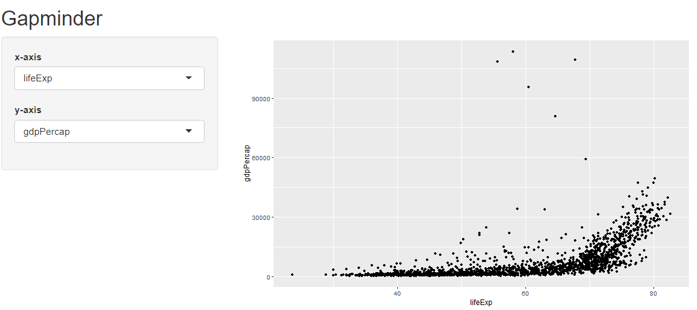
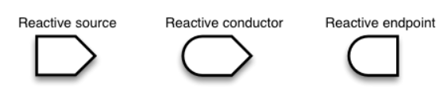
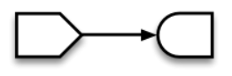
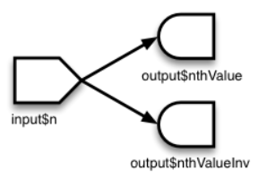
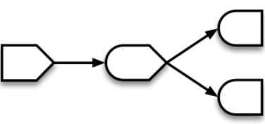
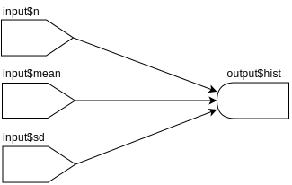
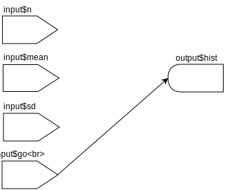

```{r, include=FALSE}
knitr::opts_chunk$set(echo = TRUE, eval = FALSE)
```

### What is Shiny? 

The `shiny` package allows to build interactive web applications for data analysis.

It can be used for, e.g.
  - building a graphical user interface for R.
  - reporting results.
  - creating interactive documents.

To build a Shiny app you only need to learn the Shiny syntax.  
If you want to customize your app you can use HTML/CSS/Javascript.  

Here are some examples: 

  - [K-Means](https://shiny.rstudio.com/gallery/kmeans-example.html)
  - [Genome Viewer](https://shiny.rstudio.com/gallery/genome-browser.html)
  - [Dashboard](https://www.rgonzo.us/shiny/apps/textanalysis/)
  
There is also a [cheatsheet](https://shiny.rstudio.com/images/shiny-cheatsheet.pdf). 
  
---


### Structure

A Shiny app consist of 2 parts

1. The user interface script 
  - controls the layout and appearance of your app.
  - contains elements for user input.
  - contains the output you want to visualize.

2. The server script
  - contains the instructions for the R session which always works behind the scene.
  - takes the user input and produces the output which is send back to the UI.

---

### A minimal example 


```{r}
library(shiny)

# The user interface
ui <- fluidPage()

# Instructions for the R backend
server <- function(input, output) {}

# Run the shiny app 
shinyApp(ui = ui, server = server)
```

Another way to build an app is 
- create a new directory (say `.../App-1`) with files `ui.R` and `server.R`
- run `shiny::runApp(".../App-1"). `

---

### User Interface  

We will now extend our app by adding a simple sidebar layout. 

```{r, eval = FALSE, echo = TRUE, results='asis'}
ui <- fluidPage(
  
  titlePanel("Title Panel"), 

  sidebarLayout(
       sidebarPanel( "Sidebar Panel"),
       mainPanel("Main Panel")
       )
)
server <- function(input, output) {}
shinyApp(ui = ui, server = server)
```

- `fluidPage()` creates a new website that we can fill with content.
-  Type any of those functions in the R console to see that HTML Code is returned. 

---
### Adding Elements for User Input 
  
```{r}
ui <- fluidPage(
  titlePanel("Title Panel"), 
  sidebarLayout(
    sidebarPanel("Sidebar Panel",
                 br(),                               # linebreak
                 br(),
                 sliderInput(inputId = "num",        # input value can be accessed from the server 
                 label = "Choose a number",          # function via the inputId via the inputId
                 value = 25, min = 1, max = 100)
                 ),
    mainPanel("Main Panel")
  )
)
```
  
You can find an overview of input elements [here](https://www.dropbox.com/s/m4fuba5t3926ykv/Input_Overview.pdf?dl=0).

---
### Create Output in the Server Function 

The server function takes the input from the UI and returns e.g. text, plots or tables
back to the UI. 

There are some rules: 

- the input is acessed by `input$inputId`.
- the output that depends on user input needs to be created by a render function.
- the output to be displayed needs to be saved as `output$outputId`.


```{r}
server <- function(input, output) {
  output$hist <- renderPlot({ 
    hist(rnorm(input$num)) 
    }) 
}
```


---
### Display Output in the User Interface

Output can be added to the user interface by one of the output functions. 

```{r}
ui <- fluidPage(
  titlePanel("Title Panel"), 
  sidebarLayout(
    sidebarPanel("Sidebar Panel",
                 br(),                        #linebreaks
                 br(),
                 sliderInput(inputId = "num", 
                       label = "Choose a number", 
                       value = 25, min = 1, max = 100)
                       ),
    mainPanel("Main Panel",
              br(),                    
              br(),
              plotOutput("hist")
              )
  )
)
```


---
### Which Render and Output Functions belong together?
<br>
```{r, eval = TRUE, echo = FALSE, warning=FALSE, message=FALSE, results='asis'}
library(pander)
a <- cbind(c("dataTableOutput","htmlOutput","imageOutput","plotOutput","tableOutput","textOutput", "verbatimTextOutput", "uiOutput"),
           c("renderDataTable","","renderImage","renderPlot","renderTable"," renderText", "renderPrint","renderUI"),
           c("a datatable","raw HTML","e.g. .png, .jpeg","e.g. a ggplot","e.g. data frame, matrix","value output", "print output","shiny UI element"))
colnames(a) <- c("Render Function", "Output Function", "What?")
a <- as.data.frame(a)
#emphasize.strong.cols(c(1,2,3))
#panderOptions("table.style", "rmarkdown")
print(knitr::kable(a, format = "html"))
```


---
### Exercises

Install and load the `gapminder` package.

1. Recreate the following app. 
Hints: The variables on the x and y axis must be numeric. The values returned by the input widgets are character strings.  

    ```{r, eval = TRUE, echo = FALSE, out.width = "1000px"}

    ```


---
<ol start=2>
<li> Add two more input variables that control the color and size of the points. 
<li> Add a slider that allows to subset the data by year. 
    ```{r, eval = TRUE, echo = FALSE, out.width = "800px"}
knitr::include_graphics("../img/shiny2.png")
    ```
</ol>

---
### Reactivity

We have already seen that the output changes automatically when we change input values change, when one of the render functions is used. 

There are 3 kinds of reactive objects. 

```{r, eval = TRUE, echo = FALSE, fig.align='center', out.width="50%"}

```

- The reactive source is usually the user input which are accesible through `input$.` It can only have dependents (its always a parent node). 
- The reactive endpoint is usually produced by one of the render functions and saved as `output$.` It can only be dependent (is always a child node). 

We have already written a simple app using those two elements.  

```{r, eval = TRUE, echo = FALSE, fig.align='center', out.width="20%"}

```

Whenever  `input$.` changes the reactive endpoints using this input are notified that they need to re-execute. 

---
### Reactivity

Which structure has the following code?

```{r, echo = TRUE}
# Calculate nth number in Fibonacci sequence
fib <- function(n) ifelse(n<3, 1, fib(n-1)+fib(n-2))

server <- function(input, output) {
  output$nthValue    <- renderText({ fib(as.numeric(input$n)) })
  output$nthValueInv <- renderText({ 1 / fib(as.numeric(input$n)) })
}
```

---
### Reactivity

Which structure has the following code?

```{r, echo = TRUE}
# Calculate nth number in Fibonacci sequence
fib <- function(n) ifelse(n<3, 1, fib(n-1)+fib(n-2))

server <- function(input, output) {
  output$nthValue    <- renderText({ fib(as.numeric(input$n)) })
  output$nthValueInv <- renderText({ 1 / fib(as.numeric(input$n)) })
}
```

There are two children nodes depending on one parent node. 

```{r, eval = TRUE, echo = FALSE, fig.align='center', out.width="25%"}

```

Furthermore, each of the childrens evaluetes `fib()` seperatly, which leads to redundant computations.  

---
### Reactivity

Using a reactive conducter created with `reactive()` the function `fib()` executes only once.  

```{r}
fib <- function(n) ifelse(n<3, 1, fib(n-1)+fib(n-2))

server <- function(input, output) {
  # reactive conductor depending on reactive source
  currentFib         <- reactive({ fib(as.numeric(input$n)) })
  # reactive endpoints depending on reactive conductor
  output$nthValue    <- renderText({ currentFib() })
  output$nthValueInv <- renderText({ 1 / currentFib() })
}
```

```{r, eval = TRUE, echo = FALSE, fig.align='center', out.width="30%"}

```
  
Note that you need `()` (here ` currentFib()`) to access the value computed by `reactive()`. 

---
### Prevent reactivity with `isolate()`

Sometimes we want to prevent that some parts of our program re-execute if input values change.
Consider the case where we we have multiple inputs and the receiving endnote runs some heavy computation. 

```{r, eacho = FALSE, eval = TRUE, fig.align='center', out.width="30%"}

```

What is the problem here?

---
### Example 


```{r}
ui <- fluidPage(
  numericInput("n", "Number of observations" ,10),
  numericInput("mean", "Mean" ,10),
  numericInput("sd", "Standard Deviation" ,10),
  actionButton("goButton", "Go!"),
  plotOutput("hist")
)

server <- function(input, output) {
output$hist <- renderPlot({
  
  x <- rnorm(input$n, mean = input$mean, sd = input$sd)
  
  hist(x)
  })
} 
shinyApp(ui, server)
```


---
### Prevent reactivity with `isolate()`

We can solve this by making the render function which produces the output unresponsive to  the parameter inputs using `isolate()`. When we are ready e.g. a button can be used to start the 
computation. 

```{r, echo = FALSE, eval = TRUE, fig.align='center', out.width="30%"}

```

---
### Example

```{r}
ui <- fluidPage(
  numericInput("n", "Number of observations" ,100),
  numericInput("mean", "Mean" ,0),
  numericInput("sd", "Standard Deviation" ,1),
  actionButton("goButton", "Go!"),
  plotOutput("hist")
)

server <- function(input, output) {
output$hist <- renderPlot({
  # Take a dependency on input$goButton
  input$goButton
  # Use isolate() to avoid dependency on the other inputs
  x <- isolate(rnorm(input$n, mean = input$mean, sd = input$sd))
  hist(x)
})
} 
shinyApp(ui, server)
```

---
### Exercise 

- Add a button to the gapminder app and let the graph only re-render if this button is hit.

---
### DataTables

The `DT` package provides a powerful tool for interactive inspection and filtration of rectangular data. 

```{r}
library(DT)

ui <- basicPage(
  h2("The mtcars data"),
  DT::dataTableOutput("mytable")
)

server <- function(input, output) {
  output$mytable = DT::renderDataTable({
    mtcars
  }, 
  filter = "top"
  )
}
  
shinyApp(ui, server)
```

---
### DataTables

We can even use the filtered rows for further computation. 

```{r}
ui <- basicPage(
  h2("The mtcars data"),
  DT::dataTableOutput("mytable"),
  plotOutput("hist")
)

server <- function(input, output) {
  output$mytable = DT::renderDataTable({
    mtcars
  }, 
  filter = "top"
  )
  output$hist <- renderPlot({
    hist(mtcars[input$mytable_rows_all, "wt"], xlim = c(min(mtcars$wt), max(mtcars$wt)))
    })
}
  
shinyApp(ui, server)
```


---
### References 

https://shiny.rstudio.com/articles/reactivity-overview.html
https://shiny.rstudio.com/articles/isolation.html
https://shiny.rstudio.com/articles/datatables.html
https://rstudio.github.io/DT/shiny.html


