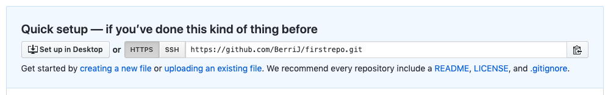
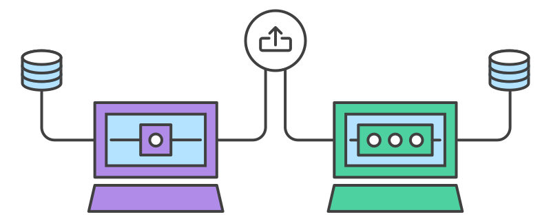

```{r setup, include=FALSE}
options(htmltools.dir.version = FALSE)
options(crayon.enabled = TRUE)
#.remark-code, .hljs, terminal { background: #272822;}
```

```{r xaringan-themer, include=FALSE}
# # solarized_dark(
# #   code_font_family = "Fira Code",
# #   code_font_url    = "https://cdn.rawgit.com/tonsky/FiraCode/1.204/distr/fira_code.css"
# # )
# library(xaringanthemer)
# 
# mono_accent(
#     base_color           = "#09017F",
#     header_font_google   = google_font("Roboto", "700"),
#     text_font_google     = google_font("Roboto Condensed"),
#     code_highlight_color = "#D2B6E8",
#     code_font_family     = "Fira Code",
#     code_font_url        = "https://cdn.rawgit.com/tonsky/FiraCode/1.204/distr/fira_code.css"
#     )

```

class: center, middle

<font size="7">Git and Github</font>


<font size="6">Alexander Gerber & Martin Arnold</font>

---
class: center

# Version Control

<br>


---
class: center

# What is a Version Control System (VCS)?

<br>


---

class: center
<br>
<br>


---
class:
# What is a VCS?

- Like a database that tracks changes of your work
- Lets you take a snapshot of your project at any time
- Independend of the technology / framework that you are working with
- Works with many file formats like Latex, R, HTML and many more.

---

# The benefits of using a VCS?

###Collaboration
Working together in a shared folder like Goole Drive / Dropbox brings conflicts very quickly.

--

### Storing Versions (Properly)
Without a VCS you would have to save the whole project every time you decide to 'save the current state'.

--

### Restoring Previous Versions
The VCS is your safety net. Every time you mess up by doing something crazy (again!) you can go back and restore the previous state.

---
# The benefits of using a VCS?

### Understanding what happened

Everytime you commit a new Version to your repository you provide a short description. 

If it's code or a text file git can additionally show you what exactly has been changed.

--

### Backup

A very nice side effect of using a distributed VCS is that it can act as a backup.

Every team member has the full version of the project (including the complete history) on its Disc.


---
class: center, middle

# What is git?


"Git is a free and open source distributed version control system designed to handle everything from small to very large projects with speed and efficiency."

---

class: center, middle

# Naming

git [British English] [Slang] = An unpleasant or contemptible person.

Quoting Linus: "I'm an egotistical bastard, and I name all my projects after myself. First 'Linux', now 'Git'".
---
class:

# Benefits of using Git

--

### Popularity

Git is (by far!) the most widely used modern version control system in the world

Used by Google, Netflix, Facebook and the Chair of Econometrics at Uni-Due

--

### Security

Git has been designed with the integrity of managed source code as a top priority.
--

### It is free and open source

---
class: center, middle

```{r, out.width = "200px", echo=FALSE}
knitr::include_graphics("images/github-logo.svg")
```

```{r, out.width = "200px", echo=FALSE}
knitr::include_graphics("images/GitHub-Logo.png")
```

---
# What is Github?

- Github hosts your git repositories online
- Having a so called 'remote repository' let's you
    + share your work with others
    + continiue your work on a different machine

# Why Github?

- Over 100 Million repositories are hosted on github
- Github belongs to Microsoft
    + Witht the support of Microsoft github under active developement
- Github is very popular
    + There are Github integrations in R-Studio, Atom, Sublime etc.
- Github has additional features that improve your workflow
    + Bug tracking
    + Managing of permissions of the repositories

---
class: center, middle

# Let's get started!


---
# First Steps

### 1. Download and Install Git 

<a href="https://git-scm.com/downloads"></a>

--

### 2. Make an Account at Github

<a href="https://github.com/join?source=header-home"></a>

--

### 3. Download and Install Github-Desktop (optional)

<a href="https://desktop.github.com/"></a>

---
# Verify your Installation:

- Git is a command line tool. That is, most of the time we will work with the command line.
- However, there is software like Github-Desktop that provides a GUI for managing your repositories.

### Start your Terminal /CMD

- Windows: Press "Win-R," type "cmd" and press "Enter"
- Mac: Open the "Terminal" Application
- Linux: you already know ;)

---

# Verify your Installation:

By typing 'git --version' git will return the installed version to you. If everything went smoothly it should look like this:

```terminal
Jonathan@MacBookPro: ~ jonathan $ git --version
git version 2.22.0
```
---

class: center, middle

# git init


---

# Create your first repository

You probably want to create a new folder for your first repository and navigate into it. However, it is perfectly fine to init a repository in an existing folder.

We create a folder called 'git', inside 'git' we create 'firstrepo' and initialize it with 'git init'.

```terminal
Jonathan@MacBookPro: ~ $ mkdir git
Jonathan@MacBookPro: ~ $ cd git
Jonathan@MacBookPro: ~/git $ mkdir firstrepo
Jonathan@MacBookPro: ~/git $ cd firstrepo
Jonathan@MacBookPro: ~/git/firstrepo $ git init
Initialized empty Git repository in 
/Users/jonathan/git/firstrepo/.git/
```
---

# Configure Git

Sometimes git asks you to provide some information (for example a commit message) and opens an editor for that. The standard is VIM. VIM can be complicated for new users. Hence we want to change the default Editor to NANO.

```terminal
Jonathan@MacBookPro: ~ $ git config --global core.editor "nano -w"

```
---

# Create a change

We have to be creative here. Maybe the students could write a function in R that is helpful later on?

---

class: center, middle

# git status


---

# git status

git status gives you an overview of your repository.

```terminal
Jonathan@MacBookPro: ~/git/firstrepo $ git status
On branch master

No commits yet

Untracked files:
  (use "git add <file>..." to include in what will be committed)

	super_important_function.r

nothing added to commit but untracked files present 
(use "git add" to track)
```

Git tells us that there is one untracked file and proposes to add this file to our repository.

---

# The basic git workflow

Developing a project usually follows the basic edit/stage/commit pattern. First, you edit your files in the working directory. When you’re ready to save a copy of the current state of the project, you stage changes with 'git add'. After you’re happy with the staged snapshot, you commit it to the project history with 'git commit'. The 'git reset' command is used to undo a commit or staged snapshot.

---

# git add

Let's stage our changes with 'git add'. We can stage all changes that are present in our working directory by executing 'git add .' Otherwise we have to specifiy the specific file instead of using a dot.

```terminal
Jonathan@MacBookPro: ~/git/firstrepo $ git add .
Jonathan@MacBookPro: ~/git/firstrepo $ git status
On branch master

No commits yet

Changes to be committed:
  (use "git rm --cached <file>..." to unstage)

	new file:   super_important_function.r
```

---

class: center, middle

# git commit


---

# git commit

Now we want to commit our changes to our repository. We can do this by typing 'git commit'. Afterward, git asks you to provide a commit message. The commit message is mandatory. Git will open an Editor for that and waits untill you saved closed the file. You can avoid this behaviour by providing the commit message directly as follows:

```terminal
Jonathan@MacBookPro: ~/git/firstrepo $ git commit -m "Init commit"
[master (root-commit) 2beba8d] Init commit
 1 file changed, 1 insertion(+)
 create mode 100644 super_important_function.r
```
---

# git commit --amend

Has to be decided if we want to add a slide for that.

---
# Writing bad Commit Messages


---

# The Seven Rules of a Great Git Commit Message

1. Separate subject from body with a blank line
2. Limit the subject line to 50 characters
3. Capitalize the subject line
4. Do not end the subject line with a period
5. Use the imperative mood in the subject line
6. Wrap the body at 72 characters
7. Use the body to explain what and why vs. how

Every commit is only as useful as it's [commit messages](http://whatthecommit.com/). Thus it makes sense investing some time in learning [how to write good commit messages](http://example.com). You'll be treated later when things went horribly wrong and you are desperately trying to recover the last working state of your project.

---

class: center, middle

# git log


---
# git log

The git log command displays committed snapshots. It lets you list the project history, filter it, and search for specific changes. Use 'git log --oneline" for a more compact output.

```terminal
Jonathan@MacBookPro: ~/git/firstrepo $ git log
commit 2d3a3ddae1d3aad34d0d521f040b53680409a80b
Author: Jonathan <Jonathan@berrisch.biz>
Date:   Thu Jul 11 10:11:36 2019 +0200

    Add awesome feature

commit 2beba8d3fc65cb18f60532c18d9f299bf5590f50
Author: Jonathan <Jonathan@berrisch.biz>
Date:   Tue Jul 9 11:49:47 2019 +0200

    Init commit

```
---

class: center, middle

# Git status vs. git log

<br>


---
class: center, middle

# Undoing Commits & Changes


---

# git checkout

The whole idea behind any version control system is to store “safe” copies of a project so that you never have to worry about irreparably breaking your code base.

When you have found a commit reference to the point in history you want to visit, you can utilize the 'git checkout' command to visit that commit. 

```terminal
Jonathan@MacBookPro: ~/git/firstrepo $ git checkout 2beba8d
Note: checking out '2beba8d3fc65cb18f60532c18d9f299bf5590f50'.

You are in 'detached HEAD' state. You can look around, make experimental
changes and commit them, and you can discard any commits you make in this
state without impacting any branches by performing another checkout.

If you want to create a new branch to retain commits you create, you may
do so (now or later) by using -b with the checkout command again. Example:

  git checkout -b <new-branch-name>

HEAD is now at 2beba8d Init commit
```
---
# The Detached Head State

On the prevoius slide git told you about a 'detached head state' and it's consequences.

During the normal course of development, the HEAD usually points to master or some other local branch, but when you check out a previous commit, HEAD no longer points to a branch—it points directly to a commit. This is called a “detached HEAD” state, and it can be visualized as the following:


---

# git revert


<br>

The git revert command can be considered an 'undo' type command, however, it is not a traditional undo operation. Instead of removing the commit from the project history, it figures out how to invert the changes introduced by the commit and appends a new commit with the resulting inverse content.

It's important to understand that git revert undoes a single commit it does not "revert" back to the previous state of a project by removing all subsequent commits. In Git, this is actually called a reset, not a revert.
---

# Different Scopes of Git Reset


---

class: center, middle

# Collaboration


---

# Collbaboration

- This is where github.com comes into play
- You can link your offline repository to a central repository on github.com
- Pull new commits from the 'remote' into your local repository
- Push new commits from your local repository into the 'remote'

Let's create a remote repository for our 'firstrepo':

1. Go to [https://github.com/new](https://github.com/new)
2. Name your remote repository
3. Decide wether it should be private or public
4. Click 'Create Repository'
5. Copy the repository link:



---

# Connecting your local Repository

- Now that we have the "remote" we want to link it to our local repo
- We can do this with 'git remote add' followed by the copied URL
- We can upload whole repository with 'git push -u origin master'

```terminal
Jonathan@MacBookPro: ~/git/firstrepo $ git remote add origin git@github.com:BerriJ/firstrepo.git
git push -u origin master
Enumerating objects: 6, done.
Counting objects: 100% (6/6), done.
Delta compression using up to 4 threads
Compressing objects: 100% (4/4), done.
Writing objects: 100% (6/6), 528 bytes | 528.00 KiB/s, done.
Total 6 (delta 0), reused 0 (delta 0)
To github.com:BerriJ/firstrepo.git
 * [new branch]      master -> master
Branch 'master' set up to track remote branch 'master' from 'origin'.
```
---
# Synchronizing

### 'git fetch'

Git fetch is the safe way. It downloads commits, files, and refs from a remote repository into your local repo. Fetching is what you do when you want to see what everybody else has been working on. Git isolates fetched content as a from existing local content, it has absolutely no effect on your local development work. To merge the fetched content into your local master branch use 'git merge origin/master'

### 'git pull'

The git pull command is used to fetch and download content from a remote repository and immediately update the local repository to match that content. Merging remote upstream changes into your local repository is a common task in Git-based collaboration work flows. The git pull command is actually a combination of two other commands, git fetch followed by git merge. 

---

# Synchronizing

### 'git fetch'

Git fetch is the safe way. It downloads commits, files, and refs from a remote repository into your local repo. Fetching is what you do when you want to see what everybody else has been working on. Git isolates fetched content as a from existing local content, it has absolutely no effect on your local development work. To merge the fetched content into your local master branch use 'git merge origin/master'

### 'git pull'

The git pull command is used to fetch and download content from a remote repository and immediately update the local repository to match that content. Merging remote upstream changes into your local repository is a common task in Git-based collaboration work flows. The git pull command is actually a combination of two other commands, git fetch followed by git merge. 

---

# Git push

- Whenever you want to push your current state to the remote you can use 'git push'

```terminal
Jonathan@MacBookPro: ~/git/firstrepo $ git push
Enumerating objects: 6, done.
Counting objects: 100% (6/6), done.
Delta compression using up to 4 threads
Compressing objects: 100% (4/4), done.
Writing objects: 100% (6/6), 528 bytes | 528.00 KiB/s, done.
Total 6 (delta 0), reused 0 (delta 0)
To github.com:BerriJ/firstrepo.git
   2d3a3dd..ceed749  master -> master
```

---

# Branching


---
# 'git branch'

Branches are esentially copies of your master branch. They are useful for developing new features or working on fixing bugs without affecting the master branch. Every branch has their own stagin area, commit history etc.

Once finished with your work you can merge your feature or bugfix branch back into master.

- Branching enshures that you master is always in a productive state.

Let's create a new branch called feature/awesomefeature

```terminal
Jonathan@MacBookPro: ~/git/firstrepo $ git branch feature/awesomefeature
```

To get a list of all available branches simply execute 'git branch'.

You can switch to your new branch by checking it out:

```terminal
Jonathan@MacBookPro: ~/git/firstrepo $ git checkout feature/awesomefeature
Switched to branch 'feature/awesomefeature'
```
---

# Exercise:

1. Create some changes
2. Stage and Commit them
3. Push them

---

# Merging


---

# 'git merge'

Merging brings branches together. Say you have finished your feature on the feature/awesomefeature branch and you are excited to merge this into your master branch. You can do this as follows:

1. Checkout the branch which is receiving the merge
2. Make shure the branch is up-to-date using 'git pull'
3. Perform the merge: git merge $\lt$ branch name $\gt$ where <branch name> is the name of the branch that will be merged into the receiving branch.

Git is pretty good in merging branches automatically. 
However, sometime you and a team mate might have worked on the exact same line of code.

---

# Merge Conflicts

Merge conflicts appear when git can not figure out how to merge automatically.
Let's create such a situation. 

```terminal
Jonathan@MacBookPro: ~/git/firstrepo $ git checkout master 
Switched to branch 'master'
Your branch is up to date with 'origin/master'.
Jonathan@MacBookPro: ~/git/firstrepo $ echo "this is some content to mess with" > merge.txt
Jonathan@MacBookPro: ~/git/firstrepo $ git add merge.txt
Jonathan@MacBookPro: ~/git/firstrepo $ git commit -m "init commit merge.txt"
[master ebc00d9] init commit merge.txt
 1 file changed, 1 insertion(+)
 create mode 100644 merge.txt
```

Now branch 'master' is ahead 1 commit of branch 'feature/awesomefeature'.

---

# Merge Conflicts

Now, we will create new commits on 'feature/awesomefeature' and on 'master'.

```terminal
Jonathan@MacBookPro: ~/git/firstrepo $ git checkout -b new_branch_to_merge_later
Switched to a new branch 'new_branch_to_merge_later'
Jonathan@MacBookPro: ~/git/firstrepo $ echo "totally different content to merge later" > merge.txt
Jonathan@MacBookPro: ~/git/firstrepo $ git add merge.txt
Jonathan@MacBookPro: ~/git/firstrepo $ git commit -m "edited the content of merge.txt"
[new_branch_to_merge_later fdfc33b] edited the content of merge.txt
 1 file changed, 1 insertion(+), 1 deletion(-)
Jonathan@MacBookPro: ~/git/firstrepo $ git checkout master
Switched to branch 'master'
Your branch is ahead of 'origin/master' by 1 commit.
  (use "git push" to publish your local commits)
Jonathan@MacBookPro: ~/git/firstrepo $ echo "content to append" >> merge.txt
Jonathan@MacBookPro: ~/git/firstrepo $ git add merge.txt
Jonathan@MacBookPro: ~/git/firstrepo $ git commit -m "appended content to merge.txt"
[master 1dec3e8] appended content to merge.txt
 1 file changed, 1 insertion(+)
```

---

# Merge Conflicts

Now we perform a merge. Merging feature/awesomefeature into master.

```terminal
Jonathan@MacBookPro: ~/git/firstrepo $ git merge new_branch_to_merge_later
Auto-merging merge.txt
CONFLICT (content): Merge conflict in merge.txt
Automatic merge failed; fix conflicts and then commit the result.
```

A merge conflict appeared. 	☠ But no worries, lets have a look at merge.txt.
	
---
# Merge Conflicts

Lets have a look at merge.txt:

```terminal
$ cat merge.txt
<<<<<<< HEAD
this is some content to mess with
content to append
=======
totally different content to merge later
>>>>>>> new_branch_to_merge_later
```
Git has created some boundaries for us:

======= Devides the merge conflict:
- Above: everything from 'us' (current branch)
- Below: everything from 'them' (branch that should be merged)

The conflict area is opened by <<<<<<< and closed by >>>>>>>. It is totally possible that one document contains multiple conflict areas.

---

# Resolving the merge conflict

The most simple way to resolve a conflict is to edit the merge.txt directly. For example we could decide to use our changes and omit the others:

```terminal
$ cat merge.txt
this is some content to mess with
content to append
```
After editing, no conflict dividers should be present anymore.

Now we can add, commit and push:

```terminal
Jonathan@MacBookPro: ~/git/firstrepo $ git add merge.txt
Jonathan@MacBookPro: ~/git/firstrepo $ git commit -m "merged and resolved the conflict in merge.txt"
[master ceed749] merged and resolved the conflict in merge.txt
Jonathan@MacBookPro: ~/git/firstrepo $ git push                                                     
[...]
To github.com:BerriJ/firstrepo.git
   2d3a3dd..ceed749  master -> master
```
---

class: center, middle

# Forking

<br>


<br>

Forking is the process of cloning a remote repository into your account. Most hosting services have an option to fork repositories.
---

# Pull Requests


<br> 

Pull requests, like forking, are server side operations. You can open a pull request to apply changes from a different branch or even from a different fork to your repository.

Pull requests are always made at the receiving repository and have to be accepted by the owner of that repository in order to be applied.

---

# Advanced Git

- [git rebase](https://git-scm.com/book/en/v2/Git-Branching-Rebasing)
  - Sometimes master progresses and you want to incorporate this progress into your branch. Rebase makes it possible to keep the history linear and does not create an extra commit like git merge would do.
  - Never rebase on public branches!
- [git add -p](https://git-scm.com/docs/git-add)
  - This command lets you choose which changes you want to add to the staging area instead of adding the changes of a whole file.
- [git stash](https://git-scm.com/docs/git-stash)
  - Save all current changes and apply them later again.
- [git clean](https://git-scm.com/docs/git-clean)
  - Remove untracked files from your repository
- [git commit --ammend](https://git-scm.com/docs/git-commit)
  - Add your staged changes onto your last commit. Don't do this if you pushed already!
- [git LFS](https://git-lfs.github.com/)
  - This is a solution to store and version large files.

Still hunrgy? Look [here](https://www.heise.de/developer/artikel/Die-vielfaeltigen-Faehigkeiten-von-Git-Teil-1-4456122.html?seite=all) and [here](https://www.heise.de/developer/artikel/Die-vielfaeltigen-Faehigkeiten-von-Git-Teil-2-4476370.html?seite=all).