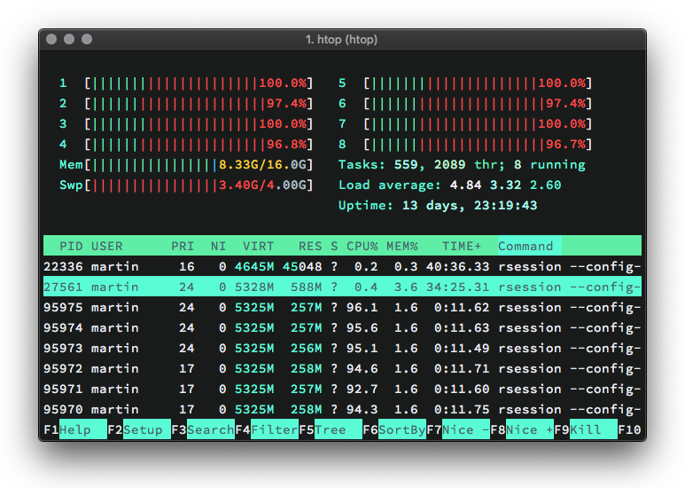
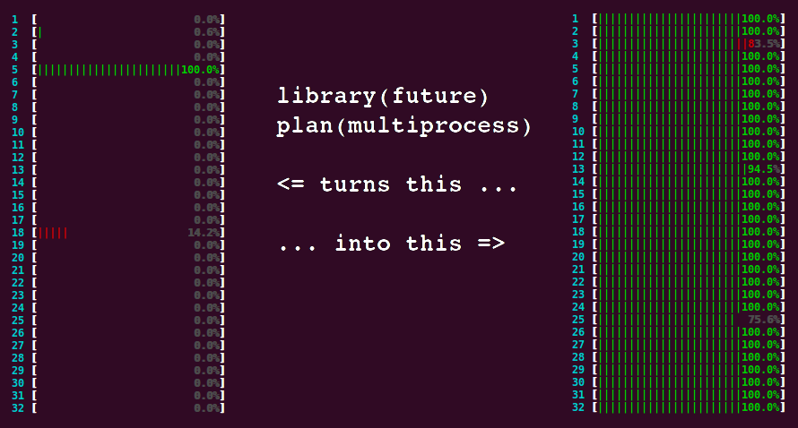

```{r setup, include=FALSE}
options(htmltools.dir.version = F)
knitr::opts_chunk$set(warning = F, message = F)
```

```{r xaringan-themer, include=FALSE}
# solarized_dark(
#   code_font_family = "Fira Code",
#   code_font_url    = "https://cdn.rawgit.com/tonsky/FiraCode/1.204/distr/fira_code.css"
# )
# library(xaringanthemer)
# 
# mono_accent(
#     base_color           = "#09017F",
#     header_font_google   = google_font("Roboto", "700"),
#     text_font_google     = google_font("Roboto Condensed"),
#     code_highlight_color = "#D2B6E8",
#     code_font_family     = "Fira Code",
#     code_font_url        = "https://cdn.rawgit.com/tonsky/FiraCode/1.204/distr/fira_code.css"
#     )
```

```{r, include=FALSE}
# packages needed
library(microbenchmark)
library(parallel)
library(tictoc)
library(dplyr)
library(tidyr)
```

class: inverse, left, middle
background-image: url(../img/road.jpg)
background-size: cover
### Improving Performance

*We should forget about small efficiencies, say about 97% of the time: premature optimization is the root of all evil. Yet we should not pass up our opportunities in that critical 3%. A good programmer will not be lulled into complacency by such reasoning, he will be wise to look carefully at the critical code; but only after that code has been identified.*

— Donald Knuth

---
### Improving Performance &mdash; Overview

Once profiling has revealed a bottleneck, we need to make it faster. In the following we will discuss some techniques that are broadly useful:

1. **Look for existing solutions.**

    Searching google can save you lots of time. The benefit of finding a faster (but possibly suboptimal) solution on your own may be small.

2. **Do as little as possible. Be precise.**

    Using optimized functions tailored for specific tasks often makes a big difference.

3. **Vectorise your code.**

    This often relates to avoiding `for()`-loops and the associated inefficiencies.

4. **Parallelise (if possible).**

    Using multiple CPU cores in parallel is enormously helpful when the computation involves a large number of tasks that may be solved independently.

---
### 1. Look for Existing Solutions

There's a good chance that someone has already tackled the same problem.

- Find out if there is a [Cran Task View](https://cran.rstudio.com/web/views/) related to your problem and search the packages listed there

- Limit your search to packages that depend on the Rcpp package (and thus likely implement high-performant C++ code). This is easily done by checking reverse dependencies of [Rcpp](https://cran.r-project.org/web/packages/Rcpp/).

- Check if a question related to your problem has been asked on [stackoverflow](https://stackoverflow.com/). Narrow the search by using suitable tags, e.g., `[r]`, `[performance]`.

- Google. For R-related results, use [rseek](https://rseek.org/).

**Record all solutions that you find not just those that immediately appear to be faster!**

- Some solutions might be initially slower but are are easier to optimize and thus end up being faster. 

- Sometimes combining the fastest parts from different approaches is helpful. 

---
### Improving Performance &mdash; Golden Rule

Before we continue, we introduce a rule we have already been implicitly following &mdash; the **golden rule of R programming**:

  ***Access the underlying C/FORTRAN routines as quickly as possible; the fewer functions calls required to achieve this, the better.***

  ***(Lovelace and Gillespie, 2016)***


The techniques discussed next follow this paradigm. 

If this is not enough, we still may rewrite (some of) the code in C++ using the Rcpp package (discussed in the next chapter).

---
### 2. Do as Little as Possible

If you cannot find existing solutions, start by reducing your code to the bare essentials.

**Example: coercion of inputs / robustness checks**

`apply()` accepts various inputs and outputs which requires coercion (which is slow).

```{r, cache = T}
X <- matrix(1:1000, ncol = 10)
Y <- as.data.frame(X)

bench::mark(
  apply(X, 1, sum),
  apply(Y, 1, sum)
)
```

---
### 2. Do as Little as Possible

A function is faster if it has less to do &mdash; obvious but often neglected!

Use a function tailored to a more specific type of input or output, or a more specific problem.

**Example: row sums &mdash; `rowSums()` vs. `apply()`**

`apply()` has a much longer call stack than `rowSums()` which is much more specific. 

```{r, cache = T}
bench::mark(
  rowSums(X),
  apply(X, 1, sum)
)
```

---
### 2. Do as Little as Possible

**Example: search vector for entry**

Testing equality is faster than testing inclusion in a set.

```{r, cache=T}
x <- 1:100

bench::mark(
  any(x == 10),
  10 %in% x
)
```

---
### 2. Do as Little as Possible

**Example: Linear Regression &mdash; computation of $SE(\widehat\beta)$**

`a()` is what we teach undergraduates which is totally fine &mdash; except if you want (only) $SE(\widehat\beta)$ and fast.

`b()` is rather focused on the essentials.

```{r, cache=T}
set.seed(1)
X <- matrix(rnorm(100), ncol = 1)
Y <- X + rnorm(100)

a <- function() {
  coefficients(summary(lm(Y ~ X - 1)))[1, 2]  
}

b <- function() {
  fit <- lm.fit(X, Y)
  c(
    sqrt(1/(length(X)-1) * sum(fit$residuals^2) * solve(t(X) %*% X))
    )
}
```

---
### 2. Do as Little as Possible

**Example: Linear Regression &mdash; computation of $SE(\widehat\beta)$**

Let's compare both approaches in a microbenchmark.

```{r, cache = T}
bench::mark(
  a(),
  b()
)
```

The difference is indeed huge.

---
### 2. Do as Little as Possible

Be as explicit as possible.

**Example: method dispatch**

```{r}
x <- runif(1e2)

bench::mark(
  mean(x),
  mean.default(x)
)
```

---
### 2. Do as Little as Possible

Benchmark against alternatives that rely on primitive functions.

**Example: primitives are faster**

```{r}
bench::mark(
  mean.default(x),
  sum(x)/length(x)
)
```

---
### 2. Do as Little as Possible &mdash; Byte Compiler

As discussed before, R's interpreter performs a number of costly operations, e.g. variable and method look-up. The `compiler` package reduces the resulting slowdown by providing a translator which generates a byte compiled version of an R function.

```{r, message=F, warning=F}
library(compiler)
```

The `compiler` package comes with the base distribution of R (base R functions are byte compiled).

```{r}
mean
```

Recent R versions perform just-in-time (JIT) compilation by default so there is no reason to compile explicitly. The following example demonstrates the usefulness of this approach.

---
### 2. Do as Little as Possible &mdash; Byte Compiler

**Example: compiled correlation matrix**

Interpreting the code is relatively more demanding than the actual 'computation'.

```{r}
corr <- my.correlation <- function(X) {
  Y <- as.matrix(X); TY <- t(Y)
  n <- nrow(X)
  p <- ncol(X)
  M <- matrix(0, p, p)
  for (i in 1:p) {
    for (j in 1:p) {
      for (k in 1:n) {
        M[i,j] <- M[i, j] + TY[i, k] * Y[k, j]
      }
    }
  }
  M <- M/n
  return(M)
}
```

---
### 2. Do as Little as Possible &mdash; Byte Compiler

**Example: compiled correlation matrix**

Let's generate a compiled version of `corr()`.

```{r}
corr_cmp <- cmpfun(corr)  # compiled version of corr()
enableJIT(0)              # disable JIT compilation

x <- matrix(rnorm(1e4), nrow = 100)

bench::mark(
  corr(x),
  corr_cmp(x),
  relative = T)[, 1:4]
```

```{r, echo=F, results='hide'}
enableJIT(3)
```

---
### 2. Do as Little as Possible &mdash; Exercises

1\. Can you come up with an even faster implementation of `b()` in the linear regression example?

2\. `rowSums2()` is an alternative implementation of `rowSums()`. Is it faster for the input `df`? Why?

```{r, eval=F}
rowSums2 <- function(df) {
out <- df[[1L]]
if (ncol(df) == 1) return(out)
    
  for (i in 2:ncol(df)) {
    out <- out + df[[i]]
  }
  out
}
    
df <- as.data.frame(
  replicate(1e3, sample(100, 1e4, replace = TRUE))
)
```

3\. What’s the difference between `rowSums()` and `.rowSums()`?

---
### 2. Do as Little as Possible &mdash; Exercises

4\. Write a faster version of `chisq.test()` that only computes the chi-square test statistic when the input is two numeric vectors with no missing values. Start by coding from the [definition](https://en.wikipedia.org/wiki/Pearson%27s_chi-squared_test).

---
### 2. Do as Little as Possible &mdash; Case Study

Imagine you want to compute the bootstrap distribution of a sample correlation using `cor_df()` and the data in the example below. Given that you want to run this many times, how can you make this code faster? 

(Hint: the function has three components that you can speed up.)

```{r, eval=F}
n <- 1e6
df <- data.frame(a = rnorm(n), b = rnorm(n))
    
cor_df <- function(df, n) {
  i <- sample(seq(n), n, replace = TRUE)
  cor(df[i, , drop = FALSE])[2, 1]
}
```

---
### 3. Vectorise your code

**What is vectorisation?** 

- Vectorisation is the process of converting an algorithm from operating on a single value at a time to operating on a **set of values** (like a vector) at one time.

- It makes problems simpler: code that operates on vectors instead of single entries of an array is often less complex to write.

**Why is it efficient?** 

(on the lowest level where functions map closely to processor instructions)

- Your computer is designed to run vectorised operations: a vectorised function may run multiple operations from a single instruction which is faster than sending individual instructions for each operation.  

---
### 3. Vectorise your code

**Why is vectorisation efficient? &mdash; ctd.** 

Many languages (including R) work on arrays that are stored in [column-major order](https://en.m.wikipedia.org/wiki/Row-_and_column-major_order) in the memory.


Disregarding these patterns by writing code which operates on $1\times1$ vectors thus means 'fighting the language'.

---
### 3. Vectorise your code

**Why is vectorisation more efficient? &mdash; ctd. **

(again less related to R itself but to what your CPU does)

**Example: vector addition**

$$\begin{pmatrix} 1 \\ 2\\ 3 \end{pmatrix}+\begin{pmatrix} 4 \\ 5\\ 6 \end{pmatrix} = \begin{pmatrix} 5 \\ 7\\ 9 \end{pmatrix}$$

- **Slow:** three instructions, three operations

    - *add $\ 1$ and $\ 4$*
    - *add $\ 2$ and $\ 5$*
    - *add $\ 3$ and $\ 6$*

- **Fast:** one instruction, one vectorised operation:

    *add $\begin{pmatrix} 1 \ 2 \  3 \end{pmatrix}'$ and $\begin{pmatrix} 4 \ 5 \  6 \end{pmatrix}'$*

    The three additions are effectively done *in parallel*.


---
### 3. Vectorise your code

**What does it mean to write 'vectorised' code in R?**

Remember that there are no 'real' scalars in R. Everything that looks like a scalar is actually a $1\times1$ vector.


```{r}
# otherwise this shouldn't work:
1[1]
```

Scalar operations thus operate on vector *elements* which (often) is needlessly cumbersome. 

---
### 3. Vectorise your code

**What does it mean to write 'vectorised' code in R?**

By 'vectorised' we mean that the function works on vectors, i.e., performs vector arithmetic and calls functions which work on vectors.

**Example: scalar vs. vectorised computation of euclidean norm** 

.pull-left[
```{r}
L2_scalar <- function(x) {
  out <- numeric(1)
  for(i in 1:length(x)) {
    out <- x[i]^2 + out 
  }
  return(sqrt(out))
}
```
]

.pull-right[
```{r}
L2_vec <- function(x) {
 return(
   sqrt(
     sum(x^2)
     )
   )
}
```
]

---
### 3. Vectorise your code

**What does it mean to write 'vectorised' code in R?**

**Example: scalar vs. vectorised computation of euclidean norm** 

```{r, cache=T}
bench::mark(
  L2_scalar(1:1e4),
  L2_vec(1:1e4)
)
```

---
### 3. Vectorise your code

**What does it mean to write 'vectorised' code in R?**

- **Do not torture the interpreter**

    Vectorization reduces the amount of intepreting R has to do: Validating that `x <- 1L` and `y <- 1:100L` are of type `integer` is equally expensive. Checking that each element of `y` is an integer is not!   

- **Use functions from base R that work on vectors**

    Vectorization may avoid loops in R. Loops in many 'vectorised' R functions are carried out in C and thus are much faster. 

    The following functions are prominent examples:

    `rowSums()`, `colSums()`, `rowMeans()`, `colMeans()`, `cumsum()`, `diff()`

- **Use matrix algebra**

    Most matrix operations that involve loops are executed by highly optimized external Fortran and C libraries. See, e.g., [BLAS](https://en.wikipedia.org/wiki/Basic_Linear_Algebra_Subprograms).

---
### 3. Vectorise your code

**Are `for()`-loops slower than `apply()`?**

`for()`-loops have the reputation of being slow(er than `apply()`). This is widespread wisdom and not always true:

- `for()` is *not* slow if we iterate over data and apply a (non-vectorised) function. Execution time is comparable to `apply()`.

- Loops are often used in an *inefficient* manner: 

    growing an object without proper initialization. &#8594; overhead due to **growing and copying** in every iteration (which is indeed slow).

**Idiomatic use of `for()`**

*Allocate required storage before the loop and fill the allocated object.*

(This is what `apply()` does under the hood.)

---
### 3. Vectorise your code

**Are `for()`-loops slow(er than `apply()`)?**

**Example: good and bad `for()`-loops**

.pull-left[.smaller[
```{r}
# bad: using c()/cbind()/rbind()
rw_bad <- function(N) {
  set.seed(1)
  out <- rnorm(1)
  for(i in 2:N) {
   out <- c(out, 
            out[i-1] + rnorm(1))
  }
  return(out)
}
```
]]

.pull-right[

]
---
### 3. Vectorise your code

**Are `for()`-loops slow(er than `apply()`)?**

**Example: good and bad `for()`-loops**

.pull-left[.smaller[
```{r}
# proper initialization / iteration
rw_good <- function(N) {
  set.seed(1)
  out <- vector("double", N)
  out[1] <- rnorm(1)
  for(i in 2:N) {
   out[i] <- rnorm(1) + out[i-1]
  }
  return(out)
}
```
]]

.pull-right[

]

---
### 3. Vectorise your code

**Are `for()`-loops slow(er than `apply()`)?**

**Example: good and bad `for()`-loops**

```{r, cache = T}
bench::mark(rw_good(10000), 
            rw_bad(10000))
```

---
### 3. Vectorise your code

**Are `for()`-loops slower than the `apply()` functions?**

**Example: `for()` vs. `apply()`**

```{r}
X <- matrix(rnorm(1000), 
            ncol = 100)

colmax <- function(x) {
  out <- numeric(ncol(x))
  for(j in 1:ncol(x)) {
    out[j] <- max(x[,j])
  }
  return(out)
}
```

---
### 3. Vectorise your code

**Are `for()`-loops slower than the `apply()` functions?**

**Example: `for()` vs. `apply()`**

```{r}
bench::mark(
  colmax(X),
  apply(X, 2, max),
  check = F
)
```

---
### 3. Vectorise your code
  
- Avoid `ifelse()` &mdash; despite being a vectorised version of the standard control flow `'if(condition) if_yes else if_no'` it is slower
    
---
### 3. Vectorise your code &mdash; Exercises

1. Compare the speed of `apply(X, 1, sum)` with the vectorised `rowSums(X)` for varying sizes of the square matrix `X` using `bench::mark()`. Consider the dimensions `1`, `1e1`, `1e2`, `1e3`, `0.5e4` and `1e5`. Visualize the results using a violin plot.

2. 

    (a) How can you vectorise the computation of a weighted sum?

    (b) How can you use `crossprod()` to compute that same sum? 

    (c) How much faster are the approaches in (a) and (b) compared to the 'naive' approach `sum(x * w)`?

3.  Find an approach to compute column maxima of a numeric matrix `X` using a `*apply()`-function which outperforms `apply(X, 2, max)`.

```{r, include=F}
X <- matrix(rnorm(1000), 
            ncol = 100)

X_list <- split(X, col(X))

sapply(X_list, max)
```

---
### 3. Vectorise your code &mdash; Case Study

**Case Study: Efficient Monte Carlo Integration**

Suppose you are interested in computing $$A = \int_0^1 x^2 \mathrm{d}x$$ using Monte Carlo (MC) integration. Consider the following algorithm which operates on $1\times 1$ vectors in a `for()`-loop:

1. *initialize `counts`*

2. `for i in 1:N`

    *Generate $\ U_i \sim i.i.d. \mathcal{U}(0,1);\ i=1,2$.*
    
    *If $\ U_2 < U_1^2$, then* `counts = counts + 1`

3. *end* `for`

4. *Estimate $A$ by `counts/N`*

---
### 3. Vectorise your code &mdash; Case Study

**Case Study: Monte Carlo Integration**

1. 
    
    (a) Implement the algorithm in a function `A_loop(N)` which returns the MC estimate of A with `N` the number of MC iterations.
    
    (b) Estimate $A$ using `A_loop(N)` with 5e5 MC iterations.

2. 

    (a) Define a function `A_vec(N)` which implements the MC algorithm in a vectorised fashion.
    
    (b) Compare `A_vec(N)` and `A_loop(N)` in a microbenchmark for `N=5e5` iterations.
    
    (c) How does the difference in performance relate to `N`?

---
### 4. Parallelisation &mdash; FAQs

**What is parallelisation?**

- In the simplest sense, parallelisation means the simultaneous use of multiple hardware resources for solving a computational problem.

- In the following we refer to parallelisation as the distribution of computing tasks over several CPUs in a shared memory system (a system where multiple CPUs access the same memory).

**Does R perform parallelisation by default?**

No. The 'stock' R version on CRAN is a single-threaded program, i.e., R does not benefit from modern multi-threaded CPUs, multiple cores let alone multiple CPUs.

---
### 4. Parallelisation &mdash; FAQs

**Is it complicated to parallelise code?**

- In general, yes. Fortunately, there are R packages for the most common platforms that do the work for us. These packages facilitate the process *substantially*. 

- In most cases, we don't even have to adjust our code in order for it to be executable in parallel.

**Which tasks can be done in parallel?**

- In principle, all operations that can be executed independently. 

- Parallel computing is often used in MC simulations which require computation of a large number of homogeneous and independent tasks.

**Is parallelisation always faster than serial computation?**

No. The costs of managing the computations (the *overhead*) may offset or even surpass time savings gained by parallel computation. This occurs, e.g., when a small number of simple tasks is solved in parallel. We will discuss an example on that.

---
### 4. Parallelisation &mdash; the `parallel` package

The `parallel` package (comes with base R) is a good starting point for parallel computing.

```{r, cache=T}
# detect numer of cores (including logical cores)
library(parallel)
detectCores()
```

The notebook used to run this script has a 2,3 GHz Intel Core i5 processor with 4 physical CPUs and supports hyper-threading, i.e., each CPU as 2 logical cores.

```{r}
# detect numer of physical cores
detectCores(logical = F)
```

Note that the behavior of `detectCores()` is platform specific and not always reliable, see `?detectCores()`.

---
### 4. Parallelisation - `parallel::mclapply()`

**Example: send them cores to sleep**

```{r, eval=F}
r <- mclapply(1:8, 
              function(i) {
                Sys.sleep(20)  # do nothing for 20 seconds
              }, 
              mc.cores = 8)    # split job across 8 cores
```



---
### 4. Parallelisation - `parallel::mclapply()`

**Example: send them cores to sleep**

What happened?

- The R session (the main Process) opened 8 sub-processes, so-called *forks* (labeled `rsession` in the activity monitor)

- The forks operate independently from the main process (but they 'know' about each other). Each fork operates on a separate core.

- `mclapply()` passes a call of `function(i) Sys.sleep(20)` to each fork. Computation (or rather doing nothing for 20 seconds) now proceeds in parallel.

- After 20 seconds the results are gathered in `r` and all forks are killed. Note that `r` is just a list with `NULL` entries.
              
---
### 4. Parallelisation

**"Embarrassingly parallel operations"**


(source: [R-Bloggers](http://www.parallelr.com/r-with-parallel-computing/))

---
### 4. Parallelisation

**Example: parallelised bootstrapping**

Remember the function `cor_df()` from the case study in *2. Do as Little as Possible*. A faster approach, `cor_df2`, is given  below.

```{r, cache=T}
n <- 1e4
df <- data.frame(a = rnorm(n), b = rnorm(n))

cor_df2 <- function(x) {
  i <- sample(seq(n), n, replace = T)
  m <- cbind(df$a[i], df$b[i])
  cor(m)[2, 1]
}
```

---
### 4. Parallelisation

**Example: parallelised bootstrapping**

Calling `cor_df2()` a large number of times is time consuming. 

```{r, eval=F}
# serial computation
s_ser <- system.time(
  r_ser <- lapply(1:1e5, cor_df2)
)
s_ser
```

```{r, echo=F}
cat('    
  user  system  elapsed 
64.202  12.516   77.047 
')
```

---
### 4. Parallelisation

**Example: parallelised bootstrapping**

Luckily, it is straightforward to bootstrap in parallel using `mclapply()`.

```{r, eval=F}
# parallel computation
s_par <- system.time(
  r_par <- mclapply(1:1e5, cor_df2, mc.cores = 8)
)
s_par
```

```{r, echo=F}
cat('    
  user  system  elapsed 
38.343   7.995   16.343 
')
```

Note that using 8 cores is (only) ~5 times faster than the serial approach due to overhead. 

---
### 4. Parallelisation

**Example: too much overhead**

Parallelisation is inefficient if the overhead exceeds the time savings. 

```{r, eval=F}
system.time(mclapply(1:1e5, sqrt, mc.cores = 8))
```

```{r, echo=F}
cat('
##   user  system elapsed 
##  0.107   0.110   0.062 
    ')
```

```{r, eval=F}
system.time(lapply(1:1e5, sqrt))
```

```{r, echo=F}
cat('
##   user  system elapsed 
##  0.034   0.001   0.035 
    ')
```

This is because the cost of the individual computations is low, and additional work is needed to send the computation to the different cores and to collect the results.

---
### 4. The `MonteCarlo` Package

- Running Monte Carlo simulations is an everyday task in econometrics. They are routinely used for approximating quantities which cannot be derived analytically, e.g. finite sample properties of a test statistic.

- Monte Carlo simulation is also an essential tool in statistical programming because we often write functions that expect random input and/or produce random output. 

    Testing whether the impementation is correct amounts to check if the statistical properties of the output are as expected, using a large number of samples.

- Often, the effort to write the simulation exceeds the effort to implement the function by a multiple. 

---
### 4. The `MonteCarlo` Package

The `MonteCarlo` package by Christian Leschinksi streamlines the process of writing Monte Carlo simulations. Useful features are:

- Simulation over a user-defined parameter grid

- Automatic parallelisation using the `snow` package

- Compilation of results in arrays. Generation of customisable LaTeX tables is possible.

The package is available on `CRAN`. 

Development version @ https://github.com/FunWithR/MonteCarlo

---
### 4. The `MonteCarlo` Package

**Example: Unit Root test**

Consider the DGP $$y_t = \rho y_{t-1} + \epsilon_t, \ \ \epsilon_t\sim N(0,1)$$ with $y_0 = 0$ and $\rho = 1.$ It is a well known result that the limit of the $t$-ratio $$t = \frac{\hat\rho-1}{s.e.(\hat\rho)}$$ can be written as a functional of Wiener processes,

$$ t \Rightarrow \frac{[W(1)]^2 -1}{2\sqrt{\int_0^1[W(r)]^2 dr}}.$$

The asymptotic distribution of $t$ is non-normal and its quantiles cannot be derived analytically.

---
### 4. The `MonteCarlo` Package

**Example: Unit Root test &mdash; ctd.**

We now use the `MonteCarlo` package to simulate the limit distribution of $t$.

```{r, message=F}
library(MonteCarlo)
```

```{r}
sim <- function(rho, Time) {
  Y <- matrix(NA_real_, ncol = 1, nrow = Time); Y[1,1] <- rnorm(1)
  
  for(t in 2:Time) { Y[t, 1] <- rho * Y[t-1, 1] + rnorm(1) }

  y <- Y[-1, , drop = FALSE]
  ylag <- Y[-Time, , drop = FALSE]
  
  fit <- lm.fit(ylag, y)
  rho <- fit$coefficients
  res <- fit$residuals
  sigma <- sqrt(1/(Time-2) * t(res) %*% res * 1/ (t(ylag) %*% ylag))

  return( list("t" = (rho[[1]] - 1)/sigma) )

}
```


---
### 4. The `MonteCarlo` Package

**Example: Unit Root test &mdash; ctd.**

```{r, cache=T, message=F, results='hide'}
# setup list of parameters
params <- list("rho" = 1, 
               "Time" = 1000)

# run parallelised MC simulation over parameter grid
r <- MonteCarlo(
  sim,
  nrep = 50000,
  param_list = params, 
  ncpus = parallel::detectCores()
)
```

We transform the simulated test statistics to a vector.

```{r}
t_sim <- apply(r$result$t, 3, c)
```

---
### 4. The `MonteCarlo` Package

**Example: Unit Root test &mdash; ctd.**

Estimates of the finite sample quantiles are close to the quantiles of the corresponding asymptotic Dickey-Fuller distribution

```{r}
quantile(t_sim, c(0.05, 0.1, 0.5, 0.9, 0.95))

fUnitRoots::qunitroot(c(0.05, 0.1, 0.5, 0.9, 0.95), trend = "nc")
```

We compare with the Gaussian distribution.

```{r, eval=F}
# plot kernel density estimate of resampled t-statistics
plot(density(t_sim), main = "Dickey-Fuller Distribution")

# add gaussian density
curve(dnorm(x), from = -4, to = 4, add = T, lty = 2, col = "red")
```

---
### 4. The `MonteCarlo` Package

**Example: Unit Root test &mdash; ctd.**

```{r, fig.retina=T, echo=F, fig.align='center', fig.height=6, fig.}
# plot kernel density estimate of resampled t-statistics
plot(density(t_sim), main = "Dickey-Fuller Distribution")

# add gaussian density
curve(dnorm(x), from = -4, to = 4, add = T, lty = 2, col = "red")
```

---
### 4. The `MonteCarlo` Package

It is a great benefit to work with the package if you want to run the simulation for several parameter combinations. 

**Example: Power of DF-Test**

We write a simple wrapper for `sim()` which returns a logical value for rejection at 5% using the asymptotic critical value.

```{r}
# asymptotic 5% critical value of the corresponding DF-distribution
crit <- fUnitRoots::qunitroot(0.05, trend = "nc")

# rejection?
sim_pow <- function(rho, Time) {
  return(
   list("t" = sim(rho, Time)[[1]] < crit)   
  )
}
```

---
### 4. The `MonteCarlo` Package

**Example: Power of DF-Test**

We consider all combination for a sequence of alternatives and three different sample sizes.

```{r, message=F, results='hide', cache=T}
# setup list of parameters (yielding 33 parameter constellations)
params <- list("rho" = seq(0.75, 1, 0.025), 
               "Time" = c(50, 100, 200))

# run parallelised MC simulation over parameter grid
r <- MonteCarlo(
  sim_pow,
  nrep = 5000,
  param_list = params, 
  ncpus = parallel::detectCores())
```

---
### 4. The `MonteCarlo` Package

**Example: Power of DF-Test**

Results in a `MonteCarlo` object are easily transformed and visualized using `tidyverse` functions.

```{r, eval = F}
library(dplyr)
library(ggplot2)

tbl <- r %>% MakeFrame() %>% tbl_df() %>% 
  group_by(rho, Time) %>% summarise(power = mean(t))

ggplot(tbl) + 
  geom_line(aes(x = rho, y = power, col = factor(Time)))
```

---
### 4. The `MonteCarlo` Package

**Example: Power of DF-Test**

Conversion of the results into a LaTeX table is particularly useful.

```{r, echo=F, fig.height=6, fig.align='center'}
library(dplyr)
library(ggplot2)

tbl <- r %>% MakeFrame() %>% tbl_df() %>% 
  group_by(rho, Time) %>% summarise(power = mean(t))

ggplot(tbl) + 
  geom_line(aes(x = rho, y = power, col = factor(Time)))
```

---
### 4. The `MonteCarlo` Package

**Example: Power of DF-Test**

```{r, eval=F}
# generate LaTeX table from simulation results
MakeTable(r, rows = "Time", "rho")
```


---
### 4. Parallelisation &mdash; Case Study

---
### Asynchronous Programming


---
### Futures

**What are futures?**

- A *future* or *promise* is a construct which describes an object that acts as a proxy for some value which will be available at some point in the future.

- A future allows execution of code until the point where its value is actually needed. 

**Why are they useful?**

- Futures can by evaluated asynchronously in a separate process (possibly on a different core/CPU), i.e. they do not block the 'main' process which is available for further processing so that other computations can run in the meantime

- Futures thus allow faster and more efficient code. They are a simple yet powerful construct for parallel computing and distributed processing.

**Is it difficult to work with futures?**

It depends. We will restrict ourselves to functions which have been *futurised*, i.e. (re)implemented using functions from the `future` package.

---
### The `future.apply` Package

```{r}
library(future.apply)
```

The `future.apply` package provides a *futurised* version of the base R `*apply()` function family.

<br>

Function             | Description
-------------------- | -------------
`future_apply()`     | apply function over array margin
`future_lapply()`    | apply function over list or vector
`future_sapply()`    | apply function over list or vector
`future_replicate()` | apply function over list or vector
`future_mapply()`    | apply function to multiple list or vector arguments
`future_Map()`       | apply function to multiple list or vector arguments

<br>

These functions operate sequentially by default but parallel computation is easily set up... 

---
### The `future.apply` Package

How to run in parallel: set `plan(multiprocess)`

<br>



---
### The `future.apply()` Package

**Example: many normal sample means**

```{r, cache=T}
tictoc::tic()
invisible(
  sapply(rep(1e5, 10000), function(x) mean(rnorm(x)))
)
tictoc::toc()
```

```{r, cache=T}
tictoc::tic()
invisible(
  future_sapply(rep(1e5, 10000), function(x) mean(rnorm(x)))
)
tictoc::toc()
```

---
### References

Gillespie, C. and Lovelace (2016), *R. Efficient R Programming*. O'Reilly Media.

Peng, Roger D. (2016). *R Programming for Data Science*. The bookdown Archive.

Wickham, H. (2019). *Advanced R*. 2nd Edition. Taylor & Francis, CRC Press.
